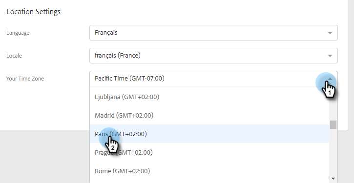

# 管理配置文件 {#manage-your-profile}

在“我的配置文件”页面中，您可以更新您的名称、帐户的语言/区域/时区，并更改密码。

## 帐户详细信息 {#account-details}

您可以在此处更新您的名称和/或密码。

1. 单击齿轮图标，然后选择 **设置**.

   

1. 默认情况下，会打开您的“我的个人资料”页面。 要更新您的名称，只需键入更改并单击 **保存**.

   

>[!NOTE]
>
>您的电子邮件地址设置为仅查看。 如果您也需要更改，请联系 [Marketo支持](https://nation.marketo.com/t5/Support/ct-p/Support).

您还可以在此部分中更改密码。 本文档中概述了这些步骤。

## 您的集成 {#your-integrations}

在页面右侧，您的集成部分提供了您帐户所有连接的状态。

>[!NOTE]
>
>如果您在Marketo Sales中使用Exchange On Prem，它将不会更新交付渠道（第1行项目）或回复跟踪（第2行项目）集成运行状况检查。 我们正努力在将来的版本中支持此功能。

## 时区 {#time-zone}

以下是如何更改帐户的语言、区域设置和/或时区。

>[!NOTE]
>
>支持的语言：英语、法语、德语、日语、葡萄牙语、西班牙语。

1. 单击齿轮图标，然后选择 **设置**.

   

1. 要更改语言，请单击 **语言** 下拉框，然后做出选择。

   

1. 此处的区域设置是指使用该语言的区域。 在您更改语言时，默认情况下会选择一个，但要手动更改，请单击 **区域设置** 下拉框，然后做出选择。

   

1. 单击 **您的时区** 下拉框，然后做出选择。

   

1. 单击 **保存** 完成时。

   

好！
