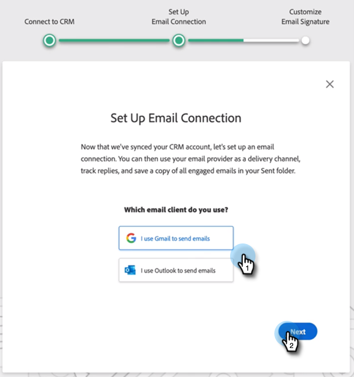

# MSI Actions用户入门指南 {#msi-actions-user-onboarding-guide}

>[!PREREQUISITES]
>
>* 管理员需要邀请用户开始使用MSI操作。
>* 要在Salesforce中激活您的帐户，您需要在Salesforce配置文件权限中启用“API”。

新用户将需要执行以下步骤。

1. 在欢迎电子邮件中，单击 **入门**.

   

1. 单击 **使用Salesforce激活帐户**.

   

1. 如果您已经登录Salesforce帐户，则会自动将您定向到下一个屏幕。 如果您未登录，请立即登录。

   

>[!NOTE]
>
>您的Salesforce电子邮件ID和销售帐户电子邮件ID必须相同。

1. 单击 **允许**.

   

1. 单击 **开始**.

   

1. 单击 **下一个**.

   

1. 选择您使用的电子邮件客户端（Gmail或Outlook），然后单击 **下一个**.

   

1. 输入您的电子邮件地址并单击 **下一个**.

   

1. 输入密码并单击 **下一个**.

   

1. 单击 **继续**.

   

>[!NOTE]
>
>如果选择Outlook，您将看到Outlook身份验证屏幕，您将在该屏幕中输入电子邮件地址。

1. 您将看到“Set Up Email Connection success（设置电子邮件连接）”消息，然后您将被发送到下一个屏幕。

   

1. 输入您的自定义签名并单击 **保存** (如果您以后想通过配置文件页面执行此操作，请单击 **跳过**)。

   

1. 单击 **完成**.

   

1. 您会看到选项，以查看Marketo Sales Actions的快速介绍。 单击 **下一个** 查看，或 **不是现在** 以备日后之用。

   

1. 完成导览后，或者跳过导览后，选择是直接登录到Web应用程序，还是直接登录Salesforce帐户，您可以从MSI面板访问所有功能(在本例中，我们选择 **启动Salesforce**)。

   

1. 在Salesforce（Classic或Lightning）中，您可以导航到任何潜在客户、联系人、帐户或商机。 所有销售操作都将通过MSI面板中的下拉菜单提供。

   
