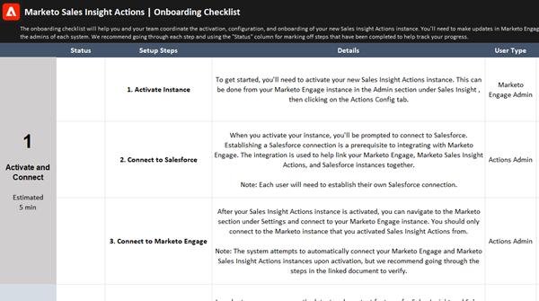

# 销售分析操作用户入门清单 {#sales-insight-actions-user-onboarding-checklist}

如果您正在寻找有关如何开始使用Marketo Sales Insight Actions的资源，请 [下载入门培训核对清单](/help/marketo/product-docs/marketo-sales-insight/actions/getting-started/assets/onboarding-checklist-marketo-sales-insight-actions-2023.xlsx).

>[!NOTE]
>
>Marketo Sales Insight Actions是一个基于Web的应用程序，它通过 [Marketo Sales Insight包](/help/marketo/product-docs/marketo-sales-insight/msi-for-salesforce/installation/install-marketo-sales-insight-package-in-salesforce-appexchange.md){target="_blank"}. 它有时称为“Marketo Sales”，或简称为“Actions”。

 

该清单将帮助您和您的团队协调新的Sales Insight Actions实例的激活、配置和载入。 您需要在Marketo、Salesforce和Marketo Sales Insight Actions中进行更新才能完成设置，因此请务必与每个系统的管理员进行协调。
