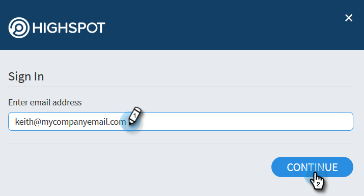

# Highspot集成 {#highspot-integration}

销售人员可以利用Sales Insight Actions的突出功能，在整个销售周期中实现更高的可见性、效率和性能。 Sales Insight Action用户可以选择存储在Highspot的销售支持平台上的销售内容，并将其直接插入电子邮件、电子邮件模板和销售促销活动中，同时在Highspot和Sales Insight Actions中捕获内容跟踪和分析。

## 启用Highspot集成 {#enabling-highspot-integration}

>[!NOTE]
>
>您必须具有管理员权限才能为Sales Insight Actions实例启用Highspot。

1. 选择设置

PICC

1. 在侧栏中选择常规设置

PICC

1. 滚动到集成卡并启用Highspot

PICC

1. 现在，当在撰写窗口、模板编辑器和营销活动电子邮件编辑器中选择内容上传按钮时，用户将看到一个选择Highspot的选项。

PICC

## 通过电子邮件访问重点内容和共享内容 {#accessing-highspot-content}

从Sales Insight Actions撰写窗口、模板编辑器和销售活动电子邮件编辑器访问Highspot并将内容添加到您的电子邮件中。 以下是如何从撰写窗口访问内容的步骤。

1. 创建您的电子邮件草稿(可通过多种方法执行此操作，在本例中，我们将选择 **撰写** （在标题中）。

   

1. 填充“收件人”字段并输入主题。

   

1. 写下你的信息。 单击电子邮件中要插入Highspot内容的位置。 单击箭头下拉列表（图像图标旁边）并选择 **Highspot**.

   

1. 登录到您的Highspot帐户。

   

1. 选择所需的内容，然后单击 **添加内容** 按钮。

   

   >[!TIP]
   >
   >如果您没有快速看到所需的内容，请使用顶部的搜索栏。

   该内容将作为链接显示在您的电子邮件中。 收件人可以单击链接以查看/下载它。

   

## 跟踪热点内容的点击次数 {#tracking-clicks-on-highspot-content}

当收件人打开您发送的内容时，您将在实时信息源中收到通知。 该活动将显示为单击，其中包含有关内容链接的详细信息。 此外，还将在Highspot中跟踪内容和下载的查看次数。

