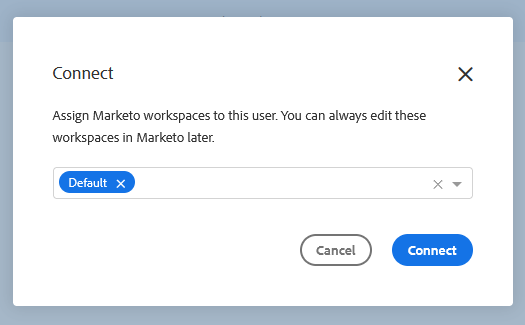

# 向用户授予Marketo访问权限 {#grant-marketo-access-to-users}

按照本文中的步骤操作，向Sales Insight Actions用户授予对Marketo连接的访问权限。 这将解锁实时信息源中的有趣时刻等功能以及对营销活动的访问权限。

您需要邀请用户访问 [销售分析操作](/help/marketo/product-docs/marketo-sales-insight/actions/admin/invite-users-and-admins.md#invite-users) （在Sales Insight Actions中）的“Marketo”>“团队访问”页面中显示这些值，并授予对Marketo连接的访问权限。

>[!CAUTION]
>
>在执行这些步骤之前，请先在将Sales Insight Actions与Marketo连接十分钟后等待。

1. 单击齿轮图标并选择 **设置**.

   

1. 在管理设置下，单击 **Marketo**.

   

1. 单击 **用户访问权限** 选项卡。 选择一个或多个用户，然后单击 **Connect**.

   

   >[!NOTE]
   >
   >在授予用户访问权限时，您只能执行一次工作区分配。 设置后，您必须断开用户连接才能进行更改。

1. 如果您的Marketo订阅启用了工作区，则您将能够批量为每个用户或用户集分配工作区。 如果未选择任何工作区，我们会将其分配给默认Marketo工作区。

   

   **可选步骤**：单击工作区下拉列表，然后选择所需的工作区。

   

1. 单击 **Connect**.

   

您可以从“团队管理”页面添加其他用户，并按照上述步骤连接这些用户。
