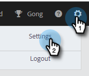

# 向用户授予Marketo访问权限 {#grant-marketo-access-to-users}

按照本文中的步骤操作，向Sales Insight Actions用户授予对Marketo连接的访问权限。 这将解锁实时信息源中令人感兴趣的时刻等功能以及营销活动的访问权限。

您需要邀请用户[Sales Insight操作](/help/marketo/product-docs/marketo-sales-insight/actions/admin/invite-users-and-admins.md#invite-users)，用户才能显示在Marketo >团队访问页面（位于Sales Insight操作中）中，该页面授予了对Marketo连接的访问权限。

>[!CAUTION]
>
>请在将Sales Insight Actions与Marketo连接之后等待10分钟，然后再执行这些步骤。

1. 单击齿轮图标并选择&#x200B;**设置**。

   

1. 在“管理员设置”下，单击&#x200B;**Marketo**。

   

1. 单击&#x200B;**用户访问**&#x200B;选项卡。 选择一个或多个用户，然后单击&#x200B;**连接**。

   

   >[!NOTE]
   >
   >在授予用户访问权限时，您只能执行一次工作区分配。 设置后，您必须断开用户连接才能进行更改。

1. 如果您的Marketo订阅启用了工作区，您将能够批量为每个用户或一组用户分配工作区。 如果未选择任何工作区，我们会将其分配给默认Marketo工作区。

   

   **可选步骤**：单击Workspace下拉列表并选择所需的工作区。

   

1. 单击&#x200B;**连接**。

   

您可以从“团队管理”页面添加其他用户，并按照上述步骤连接这些用户。
