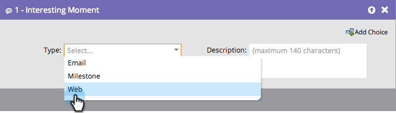

# Sales Insight操作中的有趣时刻 {#interesting-moments-in-sales-insight-actions}

有趣的时刻是通过Marketo Sales Insight Actions与您的销售团队沟通的关键。

## 什么是一个有趣的时刻？ {#what-is-an-interesting-moment}

由你来决定！ 您可以决定哪些信息与您的销售团队相关。 您的销售团队可能想知道销售线索何时出现：

* 访问您网站上的定价页面
* 单击新产品公告电子邮件中的链接
* 请求产品演示

## 我该如何创造一个有趣的时刻？ {#how-do-i-create-an-interesting-moment}

1. 选择 [智能营销活动](/help/marketo/product-docs/core-marketo-concepts/smart-campaigns/understanding-smart-campaigns.md){target="_blank"}，最好是您的销售团队在触发时觉得有趣的一个。

   

1. 拖动到 **有趣的时刻** 流程步骤。

   

1. 选择 **type** （电子邮件、里程碑或Web）。

   

1. 在 **描述** 说明此操作重要性的字段。

   

   >[!NOTE]
   >
   >Marketo还将添加发生的日期以及添加有趣时刻的方式（即潜在客户操作>流程步骤、SOAP API）。

## Marketo中一个有趣的时刻是什么样的？  {#what-does-an-interesting-moment-look-like-in-marketo}

有趣的时刻将显示在 [商机的活动日志](/help/marketo/product-docs/core-marketo-concepts/smart-lists-and-static-lists/managing-people-in-smart-lists/using-the-person-detail-page.md){target="_blank"}.

## 在Sales Insight Actions中，一个有趣的时刻是什么样的？ {#what-does-an-interesting-moment-look-like-in-sales-insight-actions}

有趣的时刻将实时显示在用户的实时信息源中。 我们利用Salesforce中的潜在客户所有者ID来显示用户对于其拥有的相关潜在客户所拥有的有趣时刻。 用户可以通过电子邮件/电话/销售活动快速跟踪潜在客户，方法是单击潜在客户名称旁边的下拉列表。

