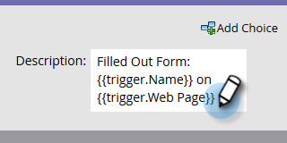

# 使营销活动在销售分析操作中可见 {#make-a-marketing-campaign-visible-in-sales-insight-actions}

只有当营销活动可见时，才能共享它们。

借助Sales Insight Actions ，用户将可以访问名为toutapp.com的新销售应用程序。 此应用为他们提供了一组新的操作功能，而且还继承了Sales Insights核心版本中提供的&#x200B;_添加到营销活动_&#x200B;功能。 请务必牢记这一点，因为根据您希望用户访问“添加到营销活动”功能的位置(toutapp.com或MSI SFDC包体验)，将需要以不同的方式配置Marketo营销活动。 请参阅步骤4中的注释以了解详情。

1. 选择（或创建）要共享的Campaign。

   

1. 单击&#x200B;**智能列表**&#x200B;选项卡。

   

1. 添加&#x200B;_Campaign is Requested_&#x200B;触发器。

   

1. 对于源，请选择“是”**Web服务API**。

   

   >[!NOTE]
   >
   >如果要向使用toutapp.com Web应用程序中的&#x200B;_Add to Marketing Campaign_&#x200B;的用户显示营销活动(这还包括您通过Marketo Sales Outbox对象将Web应用程序嵌入到CRM中的情况)，请将Campaign请求的源设置为“Web Service API”。 如果希望当用户使用Salesforce中潜在客户、联系人、客户页面的MSI面板上的操作，或者潜在客户和联系人列表视图中的批量操作按钮时显示营销活动，请将营销活动请求的源更新为“销售分析”

1. 单击&#x200B;**流量**&#x200B;选项卡。

   

1. 添加&#x200B;_有趣的时刻_&#x200B;流程操作。

   

1. 对于“类型”，选择&#x200B;**Web**。

   

1. 在&#x200B;_Description_&#x200B;框中，向您的销售团队写入一条消息。 在此示例中，我们使用令牌指定填写的表单。

   

1. 单击&#x200B;**计划**&#x200B;选项卡和&#x200B;**激活**&#x200B;营销活动。

   
