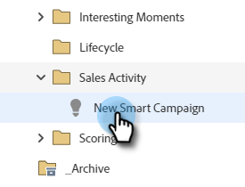

# 销售活动触发器和过滤器 {#sales-activity-triggers-and-filters}

如果您希望更好地与销售团队协调接触，或试图更好地了解他们在整个购买历程中与客户的接触情况，则Marketo中的销售活动见解将会对您有所帮助。

请按照以下步骤了解如何在智能营销活动中利用销售活动过滤器和触发器。

1. 找到并选择所需的Smart Campaign。

   

1. 在&#x200B;**[!UICONTROL Smart List]**&#x200B;选项卡中，搜索“[!UICONTROL Sales Apps]”。

   

1. 选择并拖动到所需的过滤器或触发器上。

   

1. 选择任何所需的约束。

   

>[!NOTE]
>
>有关活动、约束和定义的完整列表，请查看我们的[[!DNL Sales Insight Actions] 活动术语表](/help/marketo/product-docs/marketo-sales-insight/actions/marketo/sales-insight-actions-activity-glossary.md)。
