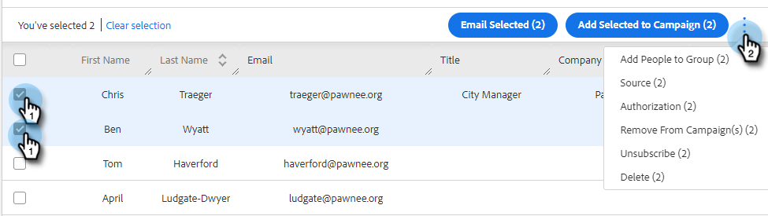

# 批量操作人员 {#bulk-actions-on-people}

您可以对联系人批量执行一些操作以节省时间。

所有可用批量操作的第一步是选择两个或多个联系人，然后单击圆点（三个垂直点）。

## 将人员添加到组 {#add-people-to-group}

将多个人员同时添加到组。

## 来源 {#source}

我们自动为进入数据库的每个联系人分配一个源。 使用此步骤更新该源。

>[!NOTE]
>
>源不可自定义。

## Authorization {#authorization}

为符合[GDPR](https://eugdpr.org/)，请使用授权来指示您是如何获得与这些联系人接触的权限的。

## 取消订阅 {#unsubscribe}

对不再希望收到您信件的联系人执行批量取消订阅。

