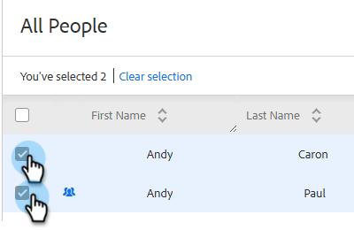
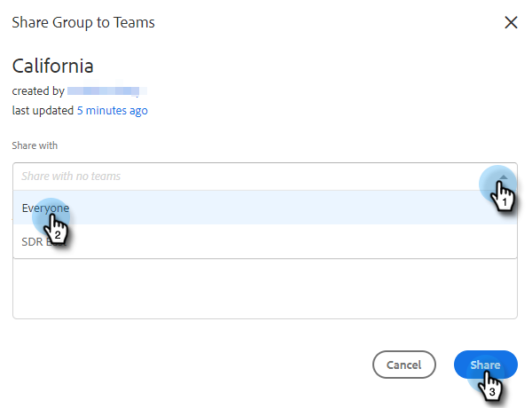

# 管理群组 {#manage-groups}

了解如何在Sales Insight Actions中管理您的群组。

## 组类型 {#group-types}

<table> 
 <colgroup> 
  <col> 
  <col> 
 </colgroup> 
 <tbody> 
  <tr> 
   <th>组</th> 
   <th>描述</th> 
  </tr> 
  <tr> 
   <td>所有人</td> 
   <td>所有用户对您可见的所有联系人。</td> 
  </tr> 
  <tr> 
   <td>动态组</td> 
   <td>我的联系人：你拥有的所有联系人。 取消订阅：已选择退出接收信函的联系人。</td> 
  </tr> 
  <tr> 
   <td>我的组</td> 
   <td>已创建的组。 他们可以包含您的联系人或与您共享的联系人。</td> 
  </tr> 
  <tr> 
   <td>团队组</td> 
   <td>与和/或您共享的组。 他们可以包含您队友的联系人，也可以包含您与他们共享的联系人。</td> 
  </tr> 
 </tbody> 
</table>

## 创建群组 {#create-a-group}

1. 在人员页面中，单击 **+** 列。

   

1. 命名您的组并单击 **创建**.

   

   就这样！

## 将联系人添加到组 {#add-contacts-to-a-group}

1. 在人员页面中，查找并选择要将人员添加到的群组。

   

1. 单击 **组操作** 选择 **创建联系人并添加到组**.

   

   >[!NOTE]
   >
   >这将一次添加一个联系人。 要同时添加多个联系人，请遵循 [这些步骤](/help/marketo/product-docs/marketo-sales-insight/actions/people/managing-contacts/import-contacts-via-csv.md).

1. 填写联系人的信息并单击 **创建** (或 **新建和添加** 添加其他)。

   

   你完蛋了！

   >[!NOTE]
   >
   >您可能需要点击刷新才能看到添加的任何新联系人。

## 共享组 {#share-a-group}

1. 在“人员”页面中，查找并选择要共享的群组。

   

1. 单击数据（三个垂直圆点），然后选择 **共享**.

   

1. 单击下拉列表，选择要与之共享群组的团队，然后单击 **共享**.

   

   您仍然拥有该组，但该组现在将显示在 _团队组_.

## 取消共享组 {#unshare-a-group}

1. 在“人员”页面中，查找并选择要取消共享的群组。

   

1. 单击数据（三个垂直圆点），然后选择 **共享**.

   

1. 单击 **X** 在您与之共享该组的团队旁边，单击模式窗口外的。

   

   该组现已取消共享。

## 重命名群组 {#rename-a-group}

1. 在“人员”页面中，查找并选择要重命名的群组。

   

1. 单击数据（三个垂直圆点），然后选择 **编辑**.

   

1. 键入新名称并单击 **保存**.

   

## 删除群组 {#delete-a-group}

1. 在“人员”页面中，查找并选择要删除的群组。

   

1. 单击数据（三个垂直圆点），然后选择 **删除**.

   

1. 单击 **删除** 确认。

   
