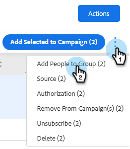

# 管理群组 {#manage-groups}

了解如何在[!DNL Sales Insight Actions]中管理您的组。

## 群组类型 {#group-types}

<table>
 <colgroup>
  <col>
  <col>
 </colgroup>
 <tbody>
  <tr>
   <th>组</th>
   <th>描述</th>
  </tr>
  <tr>
   <td>[!UICONTROL All People]</td>
   <td>所有用户对您可见的所有联系人。</td>
  </tr>
  <tr>
   <td>[!UICONTROL Dynamic Groups]</td>
   <td>我的联系人：您拥有的所有联系人。 取消订阅：已选择退出接收通信的联系人。</td>
  </tr>
  <tr>
   <td>[!UICONTROL My Groups]</td>
   <td>您已创建的组。 它们可以包含您的联系人或已与您共享的联系人。</td>
  </tr>
  <tr>
   <td>[!UICONTROL Team Groups]</td>
   <td>已与您和/或由您共享的组。 它们可以包含您的队友拥有的联系人或您与其共享的联系人。</td>
  </tr>
 </tbody>
</table>

## 创建组 {#create-a-group}

1. 在[!UICONTROL People]页面中，单击&#x200B;**旁边的**+[!UICONTROL Groups]。

   

1. 命名您的组，然后单击&#x200B;**[!UICONTROL Create]**。

   

   就是这样！

## 将联系人添加到组 {#add-contacts-to-a-group}

1. 在&#x200B;_组_&#x200B;下，选择&#x200B;**所有人员**。

   

1. 搜索要添加的一个或多个人员。

   

1. 单击其名称旁边的复选框以将其选中。

   

1. 单击“更多操作”图标()并选择&#x200B;**将人员添加到组**。

   

1. 选择要添加它们的组，然后单击&#x200B;**添加**。

   

## 共享组 {#share-a-group}

1. 在[!UICONTROL People]页面中，查找并选择要共享的组。

   

1. 单击圆点（三个垂直的点）并选择&#x200B;**[!UICONTROL Share]**。

   

1. 单击下拉列表，选择要与其共享组的团队，然后单击&#x200B;**[!UICONTROL Share]**。

   

   您仍拥有该组，但它现在将显示在&#x200B;_团队组_&#x200B;下。

## 取消共享组 {#unshare-a-group}

1. 在[!UICONTROL People]页面中，查找并选择要取消共享的组。

   

1. 单击圆点（三个垂直的点）并选择&#x200B;**[!UICONTROL Share]**。

   

1. 单击您与其共享该组的团队旁边的&#x200B;**X**，然后单击退出该模式窗口。

   

   该组现已取消共享。

## 重命名组 {#rename-a-group}

1. 在[!UICONTROL People]页面中，查找并选择要重命名的组。

   

1. 单击圆点（三个垂直的点）并选择&#x200B;**[!UICONTROL Edit]**。

   

1. 键入新名称并单击&#x200B;**[!UICONTROL Save]**。

   

## 删除组 {#delete-a-group}

1. 在“人员”页中，查找并选择要删除的组。

   

1. 单击圆点（三个垂直的点）并选择&#x200B;**[!UICONTROL Delete]**。

   

1. 单击&#x200B;**[!UICONTROL Delete]**&#x200B;确认。

   
