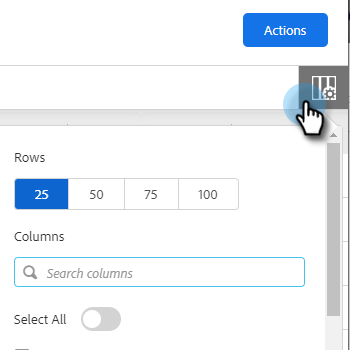

# 人员页面列 {#people-page-columns}

您可以选择通过选择显示哪些列来自定义您看到的联系信息。

## 如何选择列 {#how-to-select-columns}

1. 在“人员”页面中，单击列表设置图标。

   

1. 滚动浏览并选择所需的列(您还可以单击 **全选** （如果您想要每列）。 完成后，从列表中单击。

   

## 列描述 {#column-descriptions}

<table> 
 <colgroup> 
  <col> 
  <col> 
 </colgroup> 
 <tbody> 
  <tr> 
   <th>列</th> 
   <th>描述</th> 
  </tr> 
  <tr> 
   <td>名字（默认）</td> 
   <td>名</td> 
  </tr> 
  <tr> 
   <td>姓 （默认）</td> 
   <td>姓氏</td> 
  </tr> 
  <tr> 
   <td colspan="1">电子邮件（默认）</td> 
   <td colspan="1">电子邮件地址</td> 
  </tr> 
  <tr> 
   <td colspan="1">电话</td> 
   <td colspan="1">电话号码</td> 
  </tr> 
  <tr> 
   <td colspan="1">标题（默认）</td> 
   <td colspan="1">职务名称</td> 
  </tr> 
  <tr> 
   <td>公司（默认）</td> 
   <td>公司名称</td> 
  </tr> 
  <tr> 
   <td>营销活动（默认）</td> 
   <td>人员当前正在进行的销售活动</td> 
  </tr> 
  <tr> 
   <td>促销活动数</td> 
   <td>人员参与的促销活动总数</td> 
  </tr> 
  <tr> 
   <td>#调用</td> 
   <td>向此人发出的呼叫总数</td> 
  </tr> 
  <tr> 
   <td>#电子邮件</td> 
   <td>发送给此人的电子邮件总数</td> 
  </tr> 
  <tr> 
   <td>任务到期日期</td> 
   <td>任务到期日期</td> 
  </tr> 
  <tr> 
   <td>事件数（默认）</td> 
   <td>人员参与事件总数（查看次数、点击次数和回复次数）</td> 
  </tr> 
  <tr> 
   <td>#活动（默认）</td> 
   <td>用户为此潜在客户执行的活动总数（电子邮件、调用和任务）</td> 
  </tr> 
  <tr> 
   <td>同意</td> 
   <td>
合法利益、履行合同、遵守法律义务、保护重大利益、公共利益/官方权威等
</td> 
  </tr> 
  <tr> 
   <td>打开任务</td> 
   <td>此人员的未结任务数</td> 
  </tr> 
  <tr> 
   <td>查看次数</td> 
   <td>此人员查看的总次数</td> 
  </tr> 
  <tr> 
   <td>#点击次数</td> 
   <td>此人的总点击次数</td> 
  </tr> 
  <tr> 
   <td>回复数</td> 
   <td>此人的回复总数</td> 
  </tr> 
  <tr> 
   <td>最后更新</td> 
   <td>人员记录上次更新的日期：</td> 
  </tr> 
  <tr> 
   <td>创建者</td> 
   <td>创建人员的用户名</td> 
  </tr> 
  <tr> 
   <td>源</td> 
   <td>人员创建来源</td> 
  </tr> 
  <tr> 
   <td>组（默认）</td> 
   <td>人员所属的组</td> 
  </tr> 
  <tr> 
   <td colspan="1">退订</td> 
   <td colspan="1">销售取消订阅状态</td> 
  </tr> 
 </tbody> 
</table>
