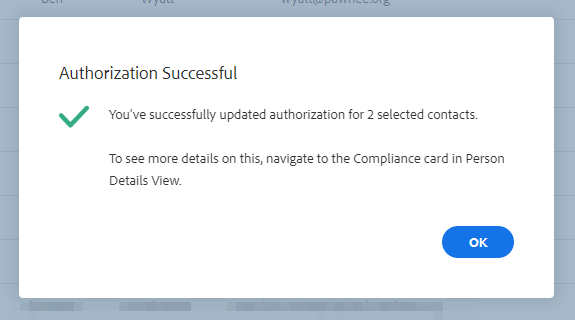

# Sales Insight Actions和GDPR合规性 {#sales-insight-actions-and-gdpr-compliance}

《通用数据保护条例》(GDPR)是一项欧盟法律，已于2018年5月25日生效。

## 概述 {#overview}

其目的是加强欧盟(EU)和欧洲经济区(EEA)内数据主体对其个人数据使用和保护方式的权利。 “个人数据”是指与已识别或可识别的自然人相关的任何信息。

GDPR围绕六项关键原则构建（详见法律第5条）：

1. 数据的使用方式及其用途的透明度。
1. 确保收集的数据仅用于收集时明确指定的目的。
1. 将数据收集限制为满足收集目的所必需的数据。
1. 确保数据的准确性。
1. 仅将数据存储所需的时间，以达到预期目的。
1. 通过部署适当的安全措施，防止未经授权使用或意外丢失数据。

此外，还提出了新的问责要求，以便能够演示如何管理和跟踪法规遵从性。 这意味着要保留有关如何及为何收集个人数据的记录，以及保护个人数据的过程的文档。

## 它适用于谁？ {#to-whom-does-it-apply}

GDPR适用于欧盟内外向欧盟和EEA内的数据主体营销商品或服务和/或跟踪数据主体行为的任何组织。 如果您在欧洲与数据主体开展业务，其中涉及对个人数据的处理，则此法规适用于您。 违规者将被处以巨额罚款，违规者将被处以巨额罚款；单次违规的最高罚款额为2,000万欧元，或全球年营业额的4%，以较大者为准。

## 对营销的影响 {#implications-for-marketing}

营销人员旨在打造一种个人化的人性化客户体验，这种体验建立在信任的基础上，交付时也会小心。 尽管GDPR不使用这些术语，但其目标相同 — 尊重客户的权利并赢得他们的信任。 要建立并维持这种信任，营销人员必须了解客户希望参与的方式、时间和原因。 尊重客户的喜好至关重要，这不仅是法律要求，也是以客户为中心的接洽实践的基础。

营销人员如何应对这些有关其工作过程中经常使用的个人数据的收集、使用和安全性的更高期望至关重要，Marketo可以帮助满足这些期望。

营销人员需要在GDPR的两个关键方面审查过去、当前和未来的实践。 第一是个人同意处理其个人数据，第二是责任，即能够展示GDPR原则是如何得到遵守的。

我们在电子书中，提供了有关Marketo平台中同意和问责制的广泛信息， [GDPR与营销人员](https://www.marketo.com/ebooks/the-gdpr-and-the-marketer/). 但是，在本篇文章中，我们将重点介绍Sales Insight Actions中的新增功能，这些功能可帮助您的组织遵守GDPR规则。

## Sales Insight Actions中的GDPR合规性 {#gdpr-compliance-in-marketo-sales-connect}

Sales Insight Actions是一个功能强大的应用程序，它是Marketo Engagement平台的一部分，为销售和营销提供了一个单一的工作流程和视图，以便通过协作参与更快地共同推动管道。 Sales Insight Actions中的新功能是专门为GDPR合规性而创建的。 我们将概述全部三个功能，并说明它们在正确使用后将如何帮助贵组织实现GDPR合规性。

## 合规性卡 {#compliance-card}

销售分析活动在人员详细信息视图中包含合规性卡，可提供有关联系人的授权类型及其来源类型的重要信息。 这使用户能够轻松添加和跟踪对数据隐私至关重要的信息，并帮助他们在营销活动/外联战略方面做出更明智的决策。

**联系人授权类型**

在合规性信息卡中，用户可以通过“授权”下拉菜单跟踪处理联系人个人数据的法律依据。 了解联系人的授权类型有助于Sales Insight Actions用户就外联实践做出更明智的决策，从而确保每个活动或参与都是合法且适当的。

用户可以从中进行多项选择，包括：

* 同意
* 合法利益
* 合同的履行
* 遵守法律义务
* 保护重要利益
* 公共利益/官方机构
* 其他

**联系源类型**

在新的合规性信息卡中，用户可以跟踪联系人的来源。 源类型定义联系人信息最初上传到Sales Insight Actions时的来源。 了解联系人的来源类型还有助于做出有关外联实践的决策，以及确定存储个人数据的其他系统或位置，确保每次接触都符合GDPR法规。

同样，用户有多种下拉选项可供选择，包括：

* CRM同步
* 导入
* 手动上传
* Chrome扩展
* 其他

**编辑合规性信息卡**

在打开人员详细信息视图时，单击 **编辑** 在合规性信息卡中。

您将看到两个下拉列表：授权类型和源类型。

如果选择“同意”作为授权类型，则会显示两个必填字段：“同意日期”和“处理目的”。 这两个字段不适用于其他选项。

如果为“授权类型”或“来源类型”选择了“其它”，则可以输入描述来源类型的文本。

**批量操作**

销售分析操作还允许批量更新联系人的授权和来源类型，从而节省法规遵从性过程中的宝贵时间。

从“人员”页面中选择一个或多个联系人时，会在右侧显示一个圆点（三个点菜单）。 单击它，您将看到“授权”和“源”选项。 您可以同时设置多个联系人的授权或来源。

在单击授权模式时，会出现一个弹出窗口，其中包含与合规性信息卡中的相应选项匹配的下拉选项。

更新授权类型后，您将收到一个确认弹出窗口，并且您可以在“人员详细信息”视图的合规性卡中看到更新的详细信息。

同样，也可以通过单击源模式来批量更新源类型。

为选定联系人选择正确的来源类型后，将显示确认窗口以确认更新成功。

## 从销售分析操作导出联系人数据 {#exporting-contact-data-from-marketo-sales-connect}

您可以从“人员详细信息”视图中导出联系人信息。 导出将下载包含以下列的.CSV文件：

<table> 
 <colgroup> 
  <col> 
  <col> 
  <col> 
 </colgroup> 
 <tbody> 
  <tr> 
   <td>名字</td> 
   <td>网站</td> 
   <td>Facebook</td> 
  </tr> 
  <tr> 
   <td>姓氏</td> 
   <td>其他</td> 
   <td>Twitter</td> 
  </tr> 
  <tr> 
   <td>公司</td> 
   <td>更新时间</td> 
   <td>LinkedIn</td> 
  </tr> 
  <tr> 
   <td>标题</td> 
   <td>创建时间</td> 
   <td>导出于</td> 
  </tr> 
  <tr> 
   <td>电子邮件ID</td> 
   <td>Salesforce ID</td> 
   <td> </td> 
  </tr> 
  <tr> 
   <td>电话号码</td> 
   <td>人员 ID</td> 
   <td> </td> 
  </tr> 
 </tbody> 
</table>

>[!NOTE]
>
>每次只能进行一次联系。 当前没有允许批量导出联系人的功能。

要导出联系人信息，请单击“人员详细信息”视图标题中的三个垂直圆点，然后选择 **导出**. 将自动下载.CSV文件。

>[!NOTE]
>
>GDPR还要求能够从UI中删除联系人，但Sales Insight Actions已具备此功能。

## 取消订阅 {#unsubscribes}

GDPR的一个常见误解领域涉及从组织数据库取消订阅的联系人。 为了遵守关于保护选择取消订阅的用户的数据的新规则， Sales Insight Actions中包含了以下功能：

**取消订阅链接：** 取消订阅链接将自动附加到从Sales Connect Web应用程序发送的所有电子邮件中，以确保为联系人提供可访问的选择退出的方式。\
**取消订阅同步：** 用户可以将取消订阅同步到其CRM (Salesforce)，也可以从其中同步取消订阅，以确保选择退出是最新的。\
**取消订阅历史记录：** 用户可以在“人员详细信息”视图中查看历史选择退出和选择加入。\
**取消订阅删除：** 选择退订联系人重新加入需要用户具有管理员权限，并证明该联系人已同意重新联系他们。

## 将来的更新 {#future-updates}

作为参与经济强大和以客户为中心的积极倡导者，Marketo理解将隐私和数据保护交由数据主体来掌控的重要性。 与其他数据保护法律一样，GDPR合规要求两方Marketo和我们的客户都做出承诺。 本文旨在帮助您以适当的方式使用Marketo来支持贵组织遵守GDPR的规定。

我们将继续密切追踪监管机构发布的适用GDPR指引及相关法例。 更新将发布到我们的托管中心： [trust.marketo.com](https://trust.marketo.com).
