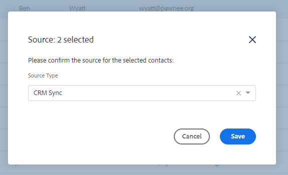

# 销售分析操作和GDPR合规性 {#sales-insight-actions-and-gdpr-compliance}

《通用数据保护条例》(GDPR)是2018年5月25日生效的欧盟法律。

## 概述 {#overview}

其目的是加强欧盟（欧盟）和欧洲经济区(EEA)内数据主体在如何使用和保护其个人数据方面的权利。 个人数据是指与已识别或可识别的自然人相关的任何信息。

GDPR的结构主要围绕六项关键原则（该法规第5条对此有详细说明）：

1. 数据的使用方式和用途的透明度。
1. 确保收集的数据仅用于收集时明确指定的目的。
1. 将数据收集限制为满足收集数据的目的所必需的内容。
1. 确保数据准确。
1. 仅在其预期用途内存储所需时间的数据。
1. 通过部署适当的安全措施防止未经授权的使用或数据意外丢失。

此外，还有一项新的责任要求，即能够证明如何管理和跟踪法规遵从性。 这意味着要保存收集个人数据的方式和原因的记录以及为保护这些数据而制定的流程的文档。

## 它适用于谁？ {#to-whom-does-it-apply}

GDPR适用于欧盟内外任何组织，该组织向欧盟和EEA内的数据主体营销商品或服务，并/或跟踪其行为。 如果您在欧洲与涉及个人数据处理的数据主体开展业务，则本法规适用于您。 对不遵守规定者的处罚相当重大，对违反规定者处以巨额罚款；单次违规的最高罚款为2000万欧元，占全球年营业额的4%，以两者中较高者为准。

## 对营销的影响 {#implications-for-marketing}

营销人员致力于打造个人和人性化的客户体验，这种体验建立在信任的基础之上，并且会谨慎提供。 尽管GDPR不使用这些条款，但其目标是相同的 — 尊重客户权利并赢得客户的信任。 要构建和维护这种信任，营销人员必须了解客户希望参与的方式、时间和原因。 必须尊重客户的偏好，这不仅是法律要求，而且也是以客户为中心的参与实践的基础。

营销人员如何应对在工作过程中经常使用的个人数据的收集、使用和安全性方面的更高期望，是关键所在，而Marketo可以帮助您满足这些期望。

GDPR的两个关键方面是营销人员需要回顾过去、现在和未来的做法。 一是个人同意处理其个人数据，二是问责制，即能够展示如何遵循GDPR原则。

我们在电子书中提供关于Marketo平台内同意和责任的广泛信息， [GDPR和营销人员](https://www.marketo.com/ebooks/the-gdpr-and-the-marketer/). 但是，在本文中，我们将特别重点介绍“销售分析操作”中的新增功能，这些功能将帮助您的组织遵守GDPR规则。

## 销售分析操作中的GDPR合规性 {#gdpr-compliance-in-marketo-sales-connect}

“销售分析操作”是Marketo参与平台的一部分，是一款功能强大的应用程序，它为销售和营销提供了单一的工作流程和视图，通过协作参与来共同加快管道速度。 “销售分析操作”中的新功能已专门针对GDPR合规性而创建。 我们将概述这三项功能，并说明在正确使用这些功能时，如何帮助您组织的GDPR合规工作。

## 合规卡 {#compliance-card}

“销售分析活动”在“人员详细信息”视图中包括一张合规卡，用于提供有关联系人的授权类型及其来源类型的关键信息。 这允许用户轻松添加和跟踪对数据隐私至关重要的信息，并帮助他们在营销活动/外联策略方面做出更明智的决策。

**联系人授权类型**

在合规性卡内，用户可以通过授权下拉列表跟踪处理联系人个人数据的法律依据。 了解联系人的授权类型有助于Sales Insight Actions用户就外联实践做出更明智的决策，确保每个营销活动或参与都是合法和适当的。

用户可以选择多种选项，包括：

* 同意
* 合法利益
* 合同的履行
* 遵守法律义务
* 重大利益保护
* 公共利益/官方权威
* 其他

**联系来源类型**

在新的合规性卡中，用户可以跟踪联系人的来源。 “来源类型”定义联系人信息最初上传到“销售分析操作”时的来源。 了解联系人的来源类型还有助于就外联实践做出决策，并确定存储了哪些其他系统或位置的个人数据，从而确保每项参与均符合GDPR法规。

同样，用户有许多下拉选项可供选择，包括：

* CRM同步
* 导入
* 手动上传
* Chrome扩展
* 其他

**编辑合规性卡**

打开“人员详细信息”视图时，单击 **编辑** 在合规性卡中。

您将看到两个下拉列表：授权类型和源类型。

如果选择“同意”作为授权类型，则需填写两个必填字段：将显示“同意日期”和“处理目的”。 这两个字段不适用于其他选项。

如果为“授权类型”或“源类型”选择了“其他”，则可以输入描述“源类型”的文本。

**批量操作**

Sales Insight Actions还允许批量更新联系人的授权和源类型，从而节省了法规遵从性过程中的宝贵时间。

从“人员”页面选择一个或多个联系人时，右侧会显示一个数据（三个圆点菜单）。 单击它，您将看到授权和源是选项。 您可以同时设置多个联系人的授权或来源。

单击授权模式时，将显示一个弹出窗口，其中包含与符合性卡中选项匹配的下拉选项。

更新授权类型后，您将收到一个确认弹出窗口，并且您将能够在人员详细信息视图的合规卡中看到更新的详细信息。

同样，也可以通过单击“源”模式批量更新“源类型”。

为选定联系人选择正确的源类型后，将显示确认窗口以确认更新成功。

## 从Sales Insight操作导出联系人数据 {#exporting-contact-data-from-marketo-sales-connect}

您可以从“人员详细信息”视图导出联系信息。 导出将下载包含以下列的.CSV文件：

<table> 
 <colgroup> 
  <col> 
  <col> 
  <col> 
 </colgroup> 
 <tbody> 
  <tr> 
   <td>名字</td> 
   <td>网站</td> 
   <td>Facebook</td> 
  </tr> 
  <tr> 
   <td>姓氏</td> 
   <td>其他</td> 
   <td>Twitter</td> 
  </tr> 
  <tr> 
   <td>公司</td> 
   <td>更新日期：</td> 
   <td>LinkedIn</td> 
  </tr> 
  <tr> 
   <td>标题</td> 
   <td>创建时间</td> 
   <td>导出位置</td> 
  </tr> 
  <tr> 
   <td>电子邮件ID</td> 
   <td>Salesforce ID</td> 
   <td> </td> 
  </tr> 
  <tr> 
   <td>电话号码</td> 
   <td>人员ID</td> 
   <td> </td> 
  </tr> 
 </tbody> 
</table>

>[!NOTE]
>
>一次只能进行一次联系。 目前没有允许批量导出联系人的功能。

要导出联系信息，请单击“人员详细信息视图”标题中的三个垂直圆点，然后选择 **导出**. 将自动下载.CSV文件。

>[!NOTE]
>
>GDPR还要求能够从UI中删除联系人，但“销售分析操作”已经具备此功能。

## 取消订阅 {#unsubscribes}

GDPR中一个经常被误解的领域涉及取消订阅组织数据库的联系人。 为了遵循有关保护选择取消订阅的用户数据的新规则，Sales Insight Actions中包含以下功能：

**取消订阅链接：** 取消订阅链接将自动附加到从Sales Connect Web应用程序发送的所有电子邮件中，以确保为联系人提供一种选择退出的无障碍方式。\
**取消订阅同步：** 用户可以同步到其CRM(Salesforce)的取消订阅和退订，以确保选择退订为最新。\
**取消订阅历史记录：** 用户可以在“人员详细信息”视图中查看历史选择退出和选择加入。\
**取消订阅删除：** 选择退回未订阅的联系人要求用户具有管理员权限，并演示该联系人已重新同意与他们联系。

## 将来的更新 {#future-updates}

作为参与式经济中权力和以客户为中心的积极倡导者，Marketo理解将隐私和数据保护交由数据主体处理的重要性。 与其他数据保护法律一样，GDPR合规要求Marketo和我们的客户都承诺要遵守。 本文旨在帮助您以适当的方式使用Marketo来支持贵组织的GDPR合规性。

我们将继续密切跟踪监管机构和相关法规发布的适用GDPR指南。 更新将发布到我们的信任中心( [trust.marketo.com](https://trust.marketo.com).
