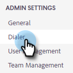
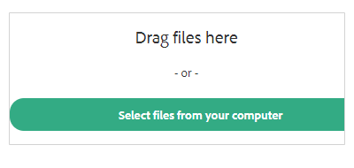

# 双方同意设置 {#two-party-consent-settings}

为了确保录制呼叫时遵守美国两党同意法，作为管理员，您可以启用自己选择的预先录制消息，在录制呼叫开始时播放。

>[!PREREQUISITES]
>
>在执行以下步骤之前，必须先[启用呼叫录制](/help/marketo/product-docs/marketo-sales-insight/actions/phone/enable-call-recording.md)。

1. 单击“设置”图标并选择&#x200B;**设置**。

   

1. 在“管理员设置”下，单击&#x200B;**常规**。

   

1. 在“电话录音”卡中，单击&#x200B;**管理录音通知**。

   

1. 单击&#x200B;**导入录制**。

   

   >[!NOTE]
   >
   >仅支持Wav和MP3文件。 上传文件不能超过30秒。

1. 从硬盘中选择所需的音频文件。

   

1. 上传完成后，在文件管理器中选择圆点（三个圆点），然后单击&#x200B;**选择作为同意通知**。 完成后单击&#x200B;**确定**。

   

1. 单击切换可允许在开始录制呼叫时播放选定的消息。

   
