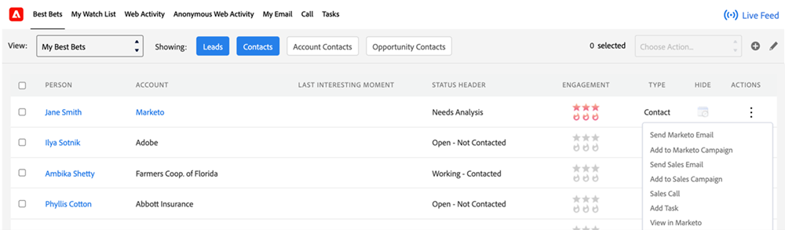

# 销售分析操作功能概述 {#msi-actions-feature-overview}

使用Sales Insight Actions在单个工作流中利用营销支持的智能和参与工具加快发现潜在客户的工作。

>[!NOTE]
>
>Marketo Sales Insight Actions是一个基于Web的应用程序，它通过 [Marketo Sales Insight包](/help/marketo/product-docs/marketo-sales-insight/msi-for-salesforce/installation/install-marketo-sales-insight-package-in-salesforce-appexchange.md){target="_blank"}. 它有时称为“Marketo Sales”，或简称为“Actions”。

>[!AVAILABILITY]
>
>此功能当前正在向所有Sales Insight用户推出。 如果您希望在推广中排定优先级，请发送电子邮件至 `sales-insights(at)adobe(dot)com`.

有关Sales Insight操作的视频概述， [单击此处](https://experienceleague.adobe.com/docs/marketo-learn/tutorials/sales-insight-actions/overview.html){target="_blank"}.

## 潜在客户布局和联系人布局 {#lead-layout-and-contact-layout}

顶部导航栏中的“选择操作”下拉列表中提供了以下操作：

* 发送销售电子邮件
   * 销售电子邮件具有查看、点击和回复跟踪（当设置了投放渠道时）
   * 包括电子邮件个性化、自定义签名和附件
   * 模板共享和报告
   * 团队共享、群发电子邮件和抄送/密送功能
   * 销售电子邮件活动将记录在Marketo人员记录中
   * Marketo Smart Campaigns中对应的过滤器和触发器（详细信息如下）

* 添加到促销活动
   * 将潜在客户添加到销售行动手册（一系列电子邮件和任务）
   * 包括团队访问和共享、任务生成、跳过周末、将OOO电子邮件忽略为回复以及自动结束
   * 营销活动将记录在Marketo人员记录中
   * Marketo Smart Campaigns中对应的过滤器和触发器（详细信息如下）

* 销售拨号器
   * 使用CRM中的拨号器进行销售呼叫
   * 包括本地存在，预先录制
   * 记录通话结果、面板中的通话记录和活动历史记录
   * 呼叫活动将记录在Marketo人员记录中
   * Marketo Smart Campaigns中的过滤器和触发器

* 添加任务
   * 为您的潜在客户创建电子邮件、呼叫、InMail和自定义任务
   * 使用Sales Campaign自动创建任务
   * 与Salesforce同步任务
   * “Salesforce活动历史记录”部分中的日志任务

您可以通过单击顶部导航中的((0))图标来访问实时信息源。 它包括查看销售活动的实时更新以及屏幕停靠功能。

以下数据在MSI面板的选项卡中可用：

* 分析功能板
   * 参与Velocity网格将包括来自销售电子邮件、销售活动操作和销售拨号器的活动
   * 即将推出的销售活动 — 当潜在客户成为正在进行中的活动的一部分时，此信息将显示在即将推出的销售活动选项卡中
   * 即将执行的任务 — 当存在与潜在客户相关的即将执行的任务时，此信息将出现在即将执行的任务选项卡中

* “电子邮件”选项卡
   * 所有发送的销售电子邮件都将记录在此处。 活动也将记录在Marketo人员记录中
   * 列包括主题、打开、单击、回复（仅适用于设置了投放渠道的销售电子邮件）、发件人、日期
   * 包括弹出信息卡，以及发件人、模板、Sales Campaign和预览电子邮件等其他详细信息

* “呼叫”选项卡
   * 使用销售拨号器功能拨打的所有电话都将记录在此处。 活动也将记录在Marketo人员记录中
   * 列包括“名称”、“结果”、“注释”、“呼叫时间”、“持续时间”和指向记录的链接
   * 包括弹出卡片，其中包含其他详细信息，如呼叫发起者、呼叫应答者、电话号码和状态

## 帐户和机会布局 {#account-and-opportunity-layout}

可以从顶部导航执行下列操作：

* 发送销售电子邮件 — 能够向与帐户/机会关联的所有联系人发送个性化或模板化的群组电子邮件，以及查看、点击和回复跟踪
   * 销售电子邮件具有查看、点击和回复跟踪（当设置了投放渠道时）
   * 包括电子邮件个性化、自定义签名和附件
   * 模板共享和报告
   * 团队共享、群发电子邮件和抄送/密送功能
   * 销售电子邮件活动将记录在Marketo人员记录中
   * Marketo Smart Campaigns中对应的过滤器和触发器（详细信息如下）

* Add to Sales Campaign — 将与帐户/机会关联的所有联系人添加到销售行动手册（一系列电子邮件和任务）
   * 将潜在客户添加到销售行动手册（一系列电子邮件和任务）
   * 包括团队访问和共享、任务生成、跳过周末、将OOO电子邮件忽略为回复以及自动结束
   * 营销活动将记录在Marketo人员记录中
   * Marketo Smart Campaigns中对应的过滤器和触发器（详细信息如下）

您可以通过单击顶部导航中的((0))图标来访问实时信息源。 它包括查看销售活动的实时更新以及屏幕停靠功能。

以下数据在选项卡中可用：

* 分析功能板
   * 参与Velocity网格将包括来自销售电子邮件、销售活动操作和销售拨号器的活动
   * 即将推出的销售活动 — 当客户/商机的联系人成为正在进行的活动的一部分时，此信息将显示在即将推出的销售活动选项卡中
   * 即将执行的任务 — 当即将执行的任务与来自客户/商机的联系人相关时，此信息将显示在即将执行的任务选项卡中

* “电子邮件”选项卡
   * 从客户/机会发送给联系人的所有销售电子邮件都将记录在此处。 活动也将记录在Marketo人员记录中
   * 列包括“主题”、“打开”、“点击”、“已回复”（仅适用于设置了投放渠道的销售电子邮件）、“发件人”和“日期”
   * 包括弹出信息卡，以及发件人、模板、Sales Campaign和预览电子邮件等其他详细信息

* “呼叫”选项卡
   * 使用sales dialer功能从客户/机会向联系人拨打的所有电话都将记录在此处。 活动也将记录在Marketo人员记录中
   * 列包括“名称”、“结果”、“注释”、“呼叫时间”、“持续时间”和录制链接
   * 包括弹出卡片，其中包含其他详细信息，如呼叫发起者、呼叫应答者、电话号码和状态

## 潜在客户和联系人列表视图（批量操作） {#lead-and-contact-list-view}

* 发送销售电子邮件 — 能够通过查看、点击和回复跟踪向联系人/潜在客户列表发送个性化或模板化电子邮件
* 发送促销活动 — 将一系列电子邮件和任务添加到联系人/潜在客户列表中的销售行动手册中

## “Marketo全局”选项卡 {#marketo-global-tab}

**“最佳匹配”选项卡**

“最佳匹配”选项卡的下拉列表中提供以下批量操作：

* 发送销售电子邮件 — 能够通过查看、点击和回复跟踪发送个性化或模板化电子邮件
* 发送销售活动 — 将潜在客户添加到销售行动手册（一系列电子邮件和任务）

   

在“最佳匹配”标签中，以下内联活动可用于单个潜在客户/联系人：

* 发送销售电子邮件 — 能够通过查看、点击和回复跟踪发送个性化或模板化电子邮件
* 发送销售活动 — 将潜在客户添加到销售行动手册（一系列电子邮件和任务）
* 销售拨号器 — 使用CRM中的拨号器进行销售呼叫
* 添加任务 — 为潜在潜在客户创建电子邮件、呼叫、客户或Linkedin任务

   

**“电子邮件”选项卡**

* 所有发送的销售电子邮件都将记录在此处。 活动也将记录在Marketo人员记录中
* 列包括“主题”、“打开”、“点击”、“已回复”（仅适用于设置了投放渠道的销售电子邮件）、“发件人”和“日期”
* 包括弹出信息卡，以及发件人、模板、Sales Campaign和预览电子邮件等其他详细信息

**“呼叫”选项卡**

* 使用销售拨号器功能拨打的所有电话都将记录在此处。 活动也将记录在Marketo人员记录中
* 列包括“名称”、“结果”、“注释”、“呼叫时间”、“持续时间”和录制链接
* 包括弹出卡片，其中包含其他详细信息，如呼叫发起者、呼叫应答者、电话号码和状态

**“任务”选项卡**

* 创建和完成的电子邮件、呼叫、InMail和自定义任务将可用于此选项卡中的任务管理。 包括添加任务的能力
* 使用Sales Campaign自动创建任务
* 与Salesforce同步任务
* “Salesforce活动历史记录”部分中的日志任务

   

**实时信息源**

* 能够查看销售活动的实时更新以及屏幕停靠功能
* 嵌入的电子邮件、呼叫和节奏按钮使每个客户见解都可操作

## Marketo中可用的功能 {#features-available-in-marketo}

Marketo中捕获的销售活动：

* 发送销售电子邮件 — 用户向潜在客户发送了销售电子邮件
* 打开销售电子邮件 — 潜在客户打开了已发送的销售电子邮件
* 单击Sales Email - Lead单击了销售电子邮件中的链接
* 回复的销售电子邮件 — 潜在客户回复的销售电子邮件
* Receive Sales Call — 潜在客户已收到使用Sales Dialer的销售人员的呼叫。
* Add to Sales Campaign — 已将Lead添加到已创建的销售活动
* 从销售活动移除 — 潜在客户已从创建的销售活动移除

筛选器和触发器包括：

* 发送销售电子邮件
* 已打开的销售电子邮件
* 已点击的销售电子邮件
* 已回复销售电子邮件
* 已接的销售电话
* 已添加到销售活动
* 已从销售活动中移除

   
