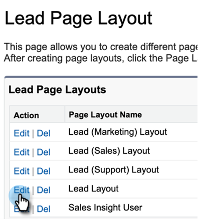

# 卸载Salesforce Classic自定义包 {#uninstall-salesforce-classic-customization-package}

开始使用MSI Actions包后，请从Salesforce帐户卸载Marketo Sales Connect包。

## 从“页面布局”中删除Sales Connect字段 {#remove-sales-connect-fields-from-page-layout}

1. 在Salesforce Classic中，单击 **设置**.

   

1. 在左侧导航的“生成”下，展开（但不单击）自定义，然后展开潜在客户。 然后，选择 **页面布局**.

   

1. 单击 **编辑** “潜在客户布局”旁边。

   

1. 在控制台中，选择 **字段**. 在“快速查找”中，搜索“MSC”。 所有灰显的字段都已添加到您的页面布局中。 你必须删除它们。

   

   >[!NOTE]
   >
   >如果所有字段均未灰显，则表示您尚未将它们添加到页面布局中。 您可以跳过此部分。

1. 滚动到包含您的Sales Connect自定义字段的部分。

   

1. 可添加到此部分的MSC字段有10种类型。 删除您添加的所有字段，或只删除整个部分。

1. 单击 **快速保存** 完成时。

   

## 从页面布局中删除Sales Connect按钮 {#remove-sales-connect-buttons-from-page-layouts}

1. 在控制台（上面的步骤4）中，选择 **按钮**. 搜索“MSC”。 所有灰显的按钮都已添加到您的自定义按钮部分。 你必须删除它们。

   

   >[!NOTE]
   >
   >如果所有按钮均未灰显，则表示您尚未添加它们。 您可以跳过此部分。

1. 将MSC按钮从“自定义按钮”部分拖放到控制台。

   

1. 单击 **快速保存** 完成时。

   

## 从活动历史记录部分删除Sales Connect字段 {#remove-sales-connect-fields-from-activity-history-section}

1. 滚动到页面底部，查看与活动历史记录相关的列表部分，然后单击扳手图标。

   

1. 从“选定字段”区域选择“Sales Connect Fields”，然后单击“删除”箭头。 单击 **确定** 完成时。

   

   >[!NOTE]
   >
   >退化MSE _is_ 销售连接。 只是前一个名字，“Marketo销售活动”。

1. 单击 **保存** 完成“潜在客户”页面时。

## 从潜在客户列表视图中删除Sales Connect批量操作按钮 {#remove-sales-connect-bulk-action-buttons-from-lead-list-view}

1. 在左侧导航的“生成”下，展开（但不单击）自定义，然后展开潜在客户。 然后，选择 **搜索布局**.

   

1. 在“潜在客户列表视图”旁边，单击 **编辑**.

   

1. 选择 **添加到MSC Campaign(Classic)**, **使用MSC(Classic)发送电子邮件**&#x200B;和 **推送到MSC(Classic)**，然后单击删除箭头。 然后，单击 **保存**.

   

您不应再在潜在客户列表视图中看到按钮。

## 删除联系人的MSC配置 {#remove-msc-configuration-for-contacts}

1. 在Salesforce中，单击 **设置**.

1. 在左侧导航的“生成”下，展开（但不单击）“自定义”，然后展开“联系人”。 然后，选择 **页面布局**.

1. 在“Contact Layout（联系布局）”旁边，单击 **编辑**.

1. 重复所有三个部分中的步骤。

## 删除Opportunity的MSC配置 {#remove-msc-configuration-for-opportunity}

1. 在Salesforce中，单击 **设置**.

1. 在左侧导航的Build下，展开（但不单击）Customize ，然后展开Opportunity 。 然后，选择 **页面布局**.

1. 在Opportunity Layout旁边，单击 **编辑**.

1. 重复所有三个部分中的步骤。

Opportunity视图只有一个按钮 — “发送MSE电子邮件”和以下字段：

## 删除帐户的MSC配置 {#remove-msc-configuration-for-account}

1. 在Salesforce中，单击 **设置**.

1. 在左侧导航的“生成”下，展开（但不单击）自定义，然后展开帐户。 然后，选择 **页面布局**.

1. 在“Account Layout（帐户布局）”旁边，单击 **编辑**.

1. 重复所有三个部分中的步骤。

“帐户视图”只有一个按钮 — “发送MSE电子邮件”和以下字段：

## 删除Marketo Sales Outbox {#remove-marketo-sales-outbox}

1. 在Salesforce中，单击 **+** 选项卡。

1. 单击 **自定义我的选项卡**.

1. 从右侧选择Marketo Sales Outbox选项。 单击删除箭头，然后单击 **保存**.

## 删除Sales Connect包 {#delete-sales-connect-package}

从Salesforce帐户中删除所有对象后，请执行以下步骤。

1. 在Salesforce中，单击 **设置**.

1. 在“快速查找”框中，输入“顶点类”。

1. 单击 **删除** “MarketoSalesConnectionCustomization”或“MarketoSalesEngageCustomization”条目旁边。

你们都准备好了！

以下是需要从Salesforce实例中删除的所有对象的列表：

## Sales Connect自定义详细信息 {#sales-connect-customization-details}

<table>
 <tr>
  <th>自定义活动字段</th>
  <th>描述</th>
  <th>类型</th>
  <th>数据类型</th>
 </tr>
 <tr>
  <td>MSC调用本地存在ID</td>
  <td>作为用户，当我从MSC Phone打电话时，我可以选择“本地存在”作为一个选项。 来电将显示接收器的本地号码</td>
  <td>活动</td>
  <td>文本</td>
 </tr>
 <tr>
  <td>MSC呼叫记录URL</td>
  <td>可以在此处记录呼叫，并记录该录音的链接 </td>
  <td>活动</td>
  <td>文本</td>
 </tr>
 <tr>
  <td>MSC Campaign</td>
  <td>联系人/潜在客户所在的MSC营销活动的日志名称</td>
  <td>活动</td>
  <td>文本</td>
 </tr>
 <tr>
  <td>MSC促销活动URL</td>
  <td>将URL记录到在MSC中创建的营销活动。 单击此按钮将打开MSC Web应用程序中的营销活动</td>
  <td>活动</td>
  <td>文本</td>
 </tr>
 <tr>
  <td>MSC促销活动当前步骤</td>
  <td>如果某个营销活动上有联系人/潜在客户，则此字段将记录他们当前所在步骤的名称</td>
  <td>活动</td>
  <td>复选框</td>
 </tr>
 <tr>
  <td>已查看MSC电子邮件附件</td>
  <td>在发送电子邮件时，如果收件人查看了附件，则会记录数据</td>
  <td>活动</td>
  <td>复选框</td>
 </tr>
 <tr>
  <td>已点击MSC电子邮件</td>
  <td>当收件人单击电子邮件中的链接时，会记录复选标记</td>
  <td>活动</td>
  <td>复选框</td>
 </tr>
 <tr>
  <td>MSC电子邮件已回复</td>
  <td>收件人回复电子邮件时记录复选标记</td>
  <td>活动</td>
  <td>文本</td>
 </tr>
 <tr>
  <td>MSC电子邮件状态</td>
  <td>显示是否发送/进行中/退回电子邮件（跟踪弹回的电子邮件取决于使用的投放渠道）</td>
  <td>活动</td>
  <td>文本</td>
 </tr>
 <tr>
  <td>MSC电子邮件模板</td>
  <td>在发送给潜在客户/联系人的电子邮件中使用的MSC模板的日志名称</td>
  <td>活动</td>
  <td>文本</td>
 </tr>
 <tr>
  <td>MSC电子邮件模板URL</td>
  <td>将URL记录到在MSC中创建的模板。 单击此按钮将在MSC Web应用程序中打开模板</td>
  <td>活动</td>
  <td>文本</td>
 </tr>
 <tr>
  <td>MSC电子邮件URL</td>
  <td>单击此URL将打开MSC中的命令中心，并拉出“人员详细信息视图”历史记录选项卡，用户可在该选项卡中查看已发送的电子邮件</td>
  <td>活动</td>
  <td>文本</td>
 </tr>
 <tr>
  <td>已查看的MSC电子邮件</td>
  <td>收件人查看电子邮件时记录复选标记</td>
  <td>活动</td>
  <td>复选框</td>
 </tr>
</table>

<table>
 <tr>
  <th>MSC汇总日志记录字段</th>
  <th>描述</th>
  <th>类型</th>
  <th>数据类型</th>
 </tr>
 <tr>
  <td>MSC — 上次营销参与</td>
  <td>营销的上次传入参与</td>
  <td>
  
帐户 
  
联系人 
  
商机 
  
机会</td>
  <td>数据和时间</td>
 </tr>
 <tr>
  <td>MSC — 上次营销参与日期</td>
  <td>营销活动参与的时间戳</td>
  <td>
  
帐户 
  
联系人 
  
商机 
  
机会</td>
  <td>数据和时间</td>
 </tr>
 <tr>
  <td>MSC — 上次营销参与设计</td>
  <td>项目描述</td>
  <td>
  
帐户 
  
联系人 
  
商机 
  
机会</td>
  <td>文本</td>
 </tr>
 <tr>
  <td>MSC — 上次营销参与来源</td>
  <td>营销参与来源</td>
  <td>
  
帐户 
  
联系人 
  
商机 
  
机会</td>
  <td>文本</td>
 </tr>
 <tr>
  <td>MSC — 上次营销参与类型</td>
  <td>参与类型(例如：Web活动)</td>
  <td>
  
帐户 
  
联系人 
  
商机 
  
机会</td>
  <td>文本</td>
 </tr>
 <tr>
  <td>MSC — 按销售列出的上一活动</td>
  <td>销售团队执行的上次传出活动</td>
  <td>
  
帐户 
  
联系人 
  
商机 
  
机会</td>
  <td>数据和时间</td>
 </tr>
 <tr>
  <td>MSC — 上次回复</td>
  <td>对销售电子邮件的上次电子邮件回复</td>
  <td>
  
帐户 
  
联系人 
  
商机 
  
机会</td>
  <td>数据和时间</td>
 </tr>
 <tr>
  <td>MSC — 当前销售活动</td>
  <td>联系人/潜在客户所在的MSC营销活动的日志名称</td>
  <td>
  
帐户 
  
联系人 
  
商机 
  
机会</td>
  <td>文本</td>
 </tr>
 <tr>
  <td>MSC — 上次销售参与</td>
  <td>销售人员的上次接入</td>
  <td>
  
帐户 
  
联系人 
  
商机 
  
机会</td>
  <td>数据和时间</td>
 </tr>
 <tr>
  <td>MSC — 选择退出</td>
  <td>选择退出字段</td>
  <td>
  
帐户 
  
联系人 
  
商机 
  
机会</td>
  <td>复选框</td>
 </tr>
</table>

<table>
 <tr>
  <th>MSC按钮</th>
  <th>描述</th>
  <th>类型</th>
 </tr>
 <tr>
  <td>发送MSC电子邮件</td>
  <td>从Salesforce发送销售电子邮件</td>
  <td>
  
帐户 
  
联系人 
  
商机 
  
机会</td>
 </tr>
 <tr>
  <td>添加到MSC Campaign</td>
  <td>从Salesforce添加到MSC促销活动</td>
  <td>
  
联系人
  
商机</td>
 </tr>
 <tr>
  <td>推送到MSC</td>
  <td>将联系人从Salesforce推送到MSC</td>
  <td>
  
联系人
  
商机</td>
 </tr>
 <tr>
  <td>使用MSC进行呼叫</td>
  <td>从Salesforce发出销售电话</td>
  <td>
  
联系人
  
商机</td>
 </tr>
</table>

<table>
 <tr>
  <th>MSC批量操作按钮</th>
  <th>描述</th>
  <th>类型</th>
 </tr>
 <tr>
  <td>添加到MSC Campaign(Classic)</td>
  <td>从Salesforce添加到MSC促销活动</td>
  <td>
  
联系人
  
商机</td>
 </tr>
 <tr>
  <td>推送到MSC(Classic)</td>
  <td>将联系人从Salesforce推送到MSC</td>
  <td>
  
联系人
  
商机</td>
 </tr>
 <tr>
  <td>使用MSC(Classic)发送电子邮件</td>
  <td>使用Salesforce中的MSC发送电子邮件</td>
  <td>
  
联系人
  
商机</td>
 </tr>
</table>
