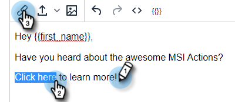
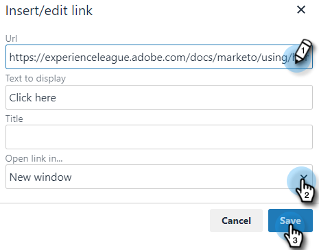

# 添加超链接文本 {#add-hyperlinked-text}

请按照以下步骤了解如何向电子邮件模板添加超链接。

1. 在“模板”页面中，选择所需的模板（或创建新模板）。

   

1. 单击 **编辑**.

   

1. 键入要添加超链接的文本（即“单击此处”）。 突出显示它并在编辑器中单击链接按钮。

   

1. 输入您希望其链接的URL(即 `https://experienceleague.adobe.com/docs/marketo/using/home.html`)。 选择要在同一窗口还是新窗口中打开URL，然后单击 **保存**.

   

1. 单击 **保存** 再来一次。

   

>[!NOTE]
>
>如果您编辑的模板当前在任何营销活动中用作电子邮件步骤，您将可以选择更新特定（或所有）营销活动的措辞。
