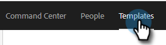

# 管理模板类别 {#manage-template-categories}

## 创建类别 {#create-a-category}

1. 单击 **模板** 选项卡。

   

1. 单击 **+** 图标 **类别**.

   

1. 输入新类别的名称，然后单击 **创建**.

   

## 重命名模板类别 {#rename-a-template-category}

1. 单击 **模板** 选项卡。

   

1. 将鼠标悬停在要重命名的模板上，然后单击数据（三个圆点）。 选择 **重命名**.

   

1. 键入新名称。 按Enter键（或者只是单击屏幕上的其他位置）保存。

   

## 删除模板类别 {#delete-a-template-category}

1. 单击 **模板** 选项卡。

   

1. 将鼠标悬停在要重命名的模板上，然后单击数据（三个圆点）。 选择 **删除**.

   

1. 单击 **删除** 确认。

   

>[!NOTE]
>
>如果类别中仍包含模板，则无法删除这些类别。 在删除类别之前移动或删除所有模板。
