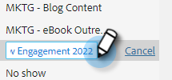

# 管理模板类别 {#manage-template-categories}

## 创建类别 {#create-a-category}

1. 单击&#x200B;**[!UICONTROL Templates]**&#x200B;选项卡。

   

1. 单击&#x200B;**旁边的**+**[!UICONTROL Categories]**&#x200B;图标。

   

1. 输入新类别的名称，然后单击&#x200B;**[!UICONTROL Create]**。

   

## 重命名模板类别 {#rename-a-template-category}

1. 单击&#x200B;**[!UICONTROL Templates]**&#x200B;选项卡。

   

1. 将鼠标悬停在要重命名的模板上，然后单击圆点（三个圆点）。 选择 **[!UICONTROL Rename]**。

   

1. 键入新名称。 按Enter键（或仅单击屏幕上的其他位置）进行保存。

   

## 删除模板类别 {#delete-a-template-category}

1. 单击&#x200B;**[!UICONTROL Templates]**&#x200B;选项卡。

   

1. 将鼠标悬停在要重命名的模板上，然后单击圆点（三个圆点）。 选择 **[!UICONTROL Delete]**。

   

1. 单击&#x200B;**[!UICONTROL Delete]**&#x200B;确认。

   

>[!NOTE]
>
>如果类别包含模板，则无法删除这些类别。 在删除类别之前移动或删除所有模板。
