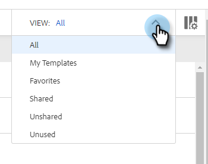

# 管理模板 {#manage-templates}

## 创建模板 {#create-a-new-template}

1. 导航到 **模板** 选项卡。

   

1. 单击 **创建模板**.

   

1. 选择 **名称** 和 **类别** ，然后单击 **创建**.

   

1. 在模板编辑器中，为电子邮件创建主题行，然后键入所需的消息。 使用编辑工具（字体、文本大小等） 自定义外观。 单击 **保存** 完成更改。

   

>[!TIP]
>
>始终在模板中直接键入文本，或从纯文本编辑器（例如，记事本或文本编辑）复制。 从富文本编辑器（例如，MS Word）复制和粘贴可能会导致格式不正常。

## 查看模板详细信息 {#view-template-details}

“模板详细信息”区域包含多个选项卡。

<table>
 <tr>
  <td><strong>模板</strong></td>
  <td>查看并进行编辑，设置标准以使模板成为推荐的模板，添加注释</td>
 </tr>
 <tr>
  <td><strong>Analytics</strong></td>
  <td>查看模板的参与度分析。 执行过滤的搜索。</td>
 </tr>
 <tr>
  <td><strong>电子邮件</strong></td>
  <td>查看使用此模板发送的所有电子邮件。 执行过滤的搜索。</td>
 </tr>
 <tr>
  <td><strong>促销活动</strong></td>
  <td>查看模板正在使用的营销活动。</td>
 </tr>
</table>

## 共享模板 {#share-a-template}

如果您使用的是我们的团队帐户之一，则默认情况下，所有模板仍为私有模板。

1. 导航到 **模板** 选项卡。

   

1. 查找并选择所需的模板。

   

1. 单击 **共享** 按钮。

   

   >[!NOTE]
   >
   >与您共享的模板将显示在 **团队模板** 标题。 团队仅适用于Premium用户。

1. 单击与共享下拉列表，然后选择要与之共享的团队。

   

1. 您可以选择将模板保留在当前类别中，或将其移动到其他类别中。 在本例中，我们将其保留在当前示例中。 单击 **共享** 完成时。

   

## 收藏模板 {#favorite-a-template}

您可以将任何类别中的模板添加到收藏夹列表。 这会自动在列表顶部生成一个新类别，以便您能够快速访问最常用的模板。

1. 导航到 **模板** 选项卡。

   

1. 找到所需的模板并将其悬停在该模板上。 单击模板名称左侧显示的星形。

   

   收藏完后，星星就会留下。

   

## 自定义模板视图 {#customize-template-view}

从 **查看** 下拉列表中，您可以选择查看：所有模板、模板、收藏模板、共享模板、非共享模板或未使用的模板（过去90天内未使用的模板）。

>[!NOTE]
>
>此外，您还可以通过单击视图下拉菜单右侧的设置图标，在模板视图中添加/删除列。

## 存档模板 {#archive-a-template}

存档模板，以保持销售内容的有序性和集中性，而不会丢失任何模板数据。

1. 选中要存档的模板旁边的复选框。

   

1. 单击 **存档**.

   

1. 单击 **存档** 确认。

   

>[!NOTE]
>
>模板存档后，便无法编辑或使用。 要再次使用该模板，请将模板从“存档”中移出并移入任何其他类别。

您还可以选择未使用的过滤器，以查看和存档90天以上未使用的模板。

## 删除模板 {#delete-a-template}

按照以下步骤删除模板。

>[!CAUTION]
>
>删除模板也会删除与其关联的所有跟踪和分析。

1. 选中要删除的模板旁边的复选框。

   

1. 单击 **删除**.

   

1. 单击 **删除** 确认。

   
