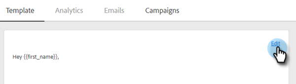

# 使用 HTML {#using-html}

1. 使用在HTML中创建电子邮件的工具（例如，Marketo的电子邮件编辑器），从电子邮件中复制源代码。

1. 选择要将HTML添加到的模板。

   

1. 在模板编辑器信息卡中，单击&#x200B;**[!UICONTROL Edit]**。

   

1. 单击模板编辑器中的&#x200B;**Source**&#x200B;按钮。

   

1. 粘贴源代码并单击&#x200B;**[!UICONTROL Save]**。

   

>[!NOTE]
>
>如果您看到错误“错误 — 要删除样式/java/html标记”，则意味着您有一些我们不支持样式。 您应该在Source代码中搜索word样式，并删除从``的所有内容。
