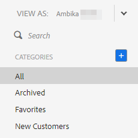

# 以其他用户身份查看模板列表 {#view-template-list-as-another-user}

作为管理员，您可以作为任何用户查看模板。

>[!NOTE]
>
>**需要管理员权限**

1. 单击 **[!UICONTROL Templates]**。

   

1. 单击&#x200B;**[!UICONTROL View As]**&#x200B;下拉列表并选择所需的用户。

   

1. 您现在正以选定用户的身份查看模板。

   

   >[!NOTE]
   >
   >您还可以使用筛选器或搜索功能以及&#x200B;_[!UICONTROL View As]_&#x200B;查看与您最相关的内容。
