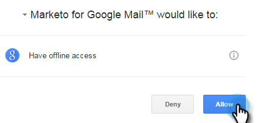

# 安装适用于Marketo Chrome的Google Insights {#install-marketo-insights-for-google-chrome}

请按照以下步骤开始使用功能强大的Chrome插件。

>[!NOTE]
>
>您无需成为Marketo管理员，即可安装该扩展。

1. 安装 [Marketo Insights for Google Chrome Add扩展](https://chrome.google.com/webstore/detail/marketo-for-google-mail/jjkfbhajlmoeegbjgjipliamplidmbjb) 从Chrome Web Store中下载。

   

1. 在Chrome中右键单击Marketo徽标，然后选择 **选项**.

   

1. 输入 **注册代码**, **电子邮件地址**, **名字**&#x200B;和 **姓氏**. 单击 **验证并保存**.

   

   >[!CAUTION]
   >
   >请务必使用 **主电子邮件帐户** 注册时，因为我们不支持使用此插件的别名。

   >[!NOTE]
   >
   >注册代码将位于Marketo管理员之后发送的电子邮件中 [向您发送Marketo电子邮件加载项许可证](/help/marketo/product-docs/marketo-sales-insight/msi-outlook-plugin/issue-a-marketo-email-add-in-license.md) [.](https://docs.marketo.com/pages/viewpage.action?pageid=7510848) **14天后过期**.

1. 单击 **允许** 允许脱机访问。

   

>[!MORELIKETHIS]
>
>[使用适用于Google Chrome的Marketo Insights](/help/marketo/product-docs/marketo-sales-insight/msi-chrome-plugin/using-marketo-insights-for-google-chrome.md)
