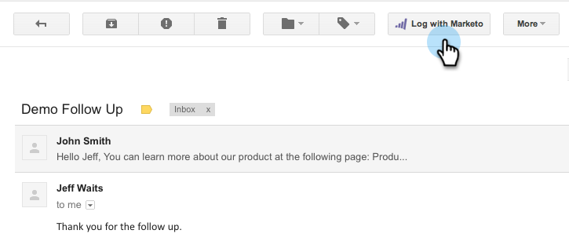

# 使用适用于Google Chrome的Marketo Insights {#using-marketo-insights-for-google-chrome}

使用适用于Google Chrome的Marketo分析，发送和跟踪任何Google电子邮件。

>[!PREREQUISITES]
>
>[安装适用于Marketo Chrome的Google Insights](/help/marketo/product-docs/marketo-sales-insight/msi-chrome-plugin/install-marketo-insights-for-google-chrome.md)

## 使用Marketo Insights发送电子邮件 {#send-an-email-with-marketo-insights}

1. 在撰写窗口中，单击Marketo图标。

   

1. “发送”按钮已将Marketo变为紫色！ 此电子邮件现在将随Marketo一起发送，并将跟踪所有链接，并将在电子邮件中插入跟踪像素。 此活动将记录为已发送销售电子邮件活动。

   

   >[!NOTE]
   >
   >跟踪像素可让您了解谁打开了您的电子邮件。

   >[!TIP]
   >
   >（可选）单击双箭头以展开到全屏视图。

1. 如果要使用已发布的Marketo模板预填电子邮件，请单击 **更多选项** 选择 **加载Marketo模板**.

   

1. 选择 **可用模板** 单击 **确定**.

   

1. 输入您的内容、电子邮件地址，然后单击 **发送**.

   

   >[!NOTE]
   >
   >仅当 **发送** 按钮为紫色。

1. 该电子邮件很快将显示在您的Marketo Sales Insight中，并且会跟踪任何打开数和点击数。

   

## 使用Marketo记录电子邮件回复 {#log-email-replies-with-marketo}

您可以记录潜在客户活动历史记录中的回复和旧活动。

1. 在Google Mail的预览窗格中，单击 **使用Marketo登录**.

   

1. 仅此而已！ 该电子邮件很快将显示在Marketo Sales Insight中。

   

   >[!MORELIKETHIS]
   >
   >* [安装适用于Marketo Chrome的Google Insights](/help/marketo/product-docs/marketo-sales-insight/msi-chrome-plugin/install-marketo-insights-for-google-chrome.md)
   >* [在Google Mail中查看人员和帐户信息和活动](/help/marketo/product-docs/marketo-sales-insight/msi-chrome-plugin/view-person-and-account-information-and-activities-in-google-mail.md)

