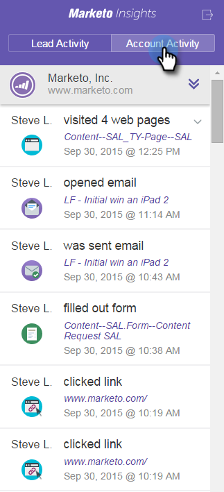

# 在Google Mail中查看人员和帐户信息和活动 {#view-person-and-account-information-and-activities-in-google-mail}

## 在Google Mail中查看活动 {#view-activities-in-google-mail}

使用上下文Marketo Insights窗格查看帐户信息和最近活动。

该窗格会显示在收件箱和“已发送”项目的普通Google邮件阅读窗格中，并显示向您发送所阅读电子邮件（或向“已发送”文件夹中的项目发送电子邮件）的人员的信息和活动。

人员活动选项卡显示与人员相关的信息，如姓名、职务、图片等。 您还可以查看在发送电子邮件后发生的最新活动，例如访问网页、填写表单、单击链接、参加活动以及打开电子邮件。

“帐户活动”选项卡显示相关的帐户信息，如公司名称、网站URL和位置。 该选项卡还会显示最近的帐户活动。 帐户由人员域标识。 如果订阅中的任何Sales Insight用户曾对应过活动，则列表中会显示这些活动。

如果您的团队从未与该人员交换过销售电子邮件，则不会显示任何活动。

单击图标以折叠窗格。

单击Marketo图标以展开窗格。

## 在Google Chrome中查看活动 {#view-activities-in-google-chrome}

您还可以使用Google Chrome中的“全局活动窗格”，查看最近发生的所有人员的全部活动列表。 这是一个实时更新的信息源，在图标上持续显示未读活动的数量。

单击Marketo图标以打开窗格。

>[!MORELIKETHIS]
>
>[使用Marketo Insights for Google Chrome](/help/marketo/product-docs/marketo-sales-insight/msi-chrome-plugin/using-marketo-insights-for-google-chrome.md)
