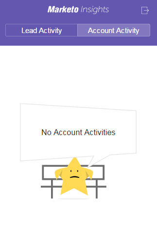

# 视图人和帐户信息及Google邮件中的活动 {#view-person-and-account-information-and-activities-in-google-mail}

>[!NOTE]
>
>**FYI**
>
>Marketo现在正在所有订阅实现语言标准化，因此您可能会在订阅和docs.marketo.com中看到潜在客户／潜在客户。 这些术语的含义是相同的；它不影响文章说明。 还有一些其他变化。 [了解更多](http://docs.marketo.com/display/DOCS/Updates+to+Marketo+Terminology)。

## 视图活动 {#view-activities-in-google-mail}

使用上下文营销工具的“洞察”窗格查看帐户信息和最近的活动。

该窗格将同时显示在全屏起草窗口中和作为普通的Google邮件阅读窗格。 在合成视图中，窗格显示在“收件人”行中输入的第一个人的信息和活动。 在阅读视图中，窗格显示向您发送您正在阅读的电子邮件的人员的信息和活动。

“人员活动”选项卡显示有关人员的相关信息，如姓名、职务、图片等。 您还可以查看发送电子邮件后发生的最新活动，如访问网页、填写表单、单击链接、参加事件和打开电子邮件。

“帐户活动”选项卡显示相关帐户信息，如公司名称、网站URL和位置。 该选项卡还显示最近的帐户活动。 帐户由person域标识。 活动在您订阅中的任何Sales Insight用户曾与他们对应时显示在列表中。

如果您的团队从未与此人交换过销售电子邮件，则不会显示任何活动。

单击该图标可折叠窗格。

单击“营销人员”图标以展开窗格。

## 视图活动在Google Chrome中 {#view-activities-in-google-chrome}

您还可以使用Google Chrome中的“全局活动”窗格来查看最近与您通信的所有人所发生的最新活动的完整列表。 这是实时更新的源，它会持续显示图标上未读活动的数量。

单击“营销人员”图标以打开窗格。

>[!NOTE]
>
>**相关文章**
>
>[使用Google Chrome的Marketo Insights](using-marketo-insights-for-google-chrome.md)

