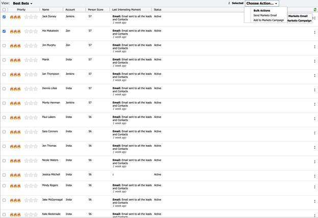

# [!DNL Best Bets] {#best-bets}

[!UICONTROL Best Bets]选项卡包括您所有热门商机的列表（基于其优先级），使用紧急程度和相对分数计算。

通过单击“操作”列下的点菜单，您可以使用参与选项，例如：

* [!UICONTROL Send Marketo Email]
* [!UICONTROL Add to Marketo Campaign]

您还可以从[!DNL Best Bets]选项卡中选择多个潜在客户，然后选择&#x200B;_[!UICONTROL Send Marketo Email]_&#x200B;或_[!UICONTROL Add to Marketo Campaign]_。

