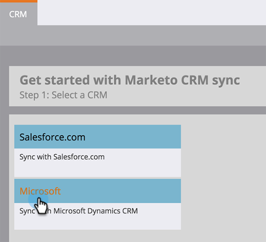

# 下载[!DNL Marketo Sales Insight]的[!DNL Microsoft Dynamics]解决方案 {#download-the-marketo-sales-insight-solution-for-microsoft-dynamics}

>[!NOTE]
>
>**需要管理员权限**

>[!IMPORTANT]
>
>此页面上的插件适用于那些使用Marketo的本机CRM同步解决方案同步到Marketo Engage的用户。 [!DNL Dynamics 365]对于拥有自定义同步[!DNL MS Dynamics 365 Online] （9.x及更高版本）并已购买[!DNL Marketo Sales Insight]的用户，[包位于此处](https://mktg-cdn.marketo.com/community/MarketoSalesInsight_NonNative.zip){target="_blank"}。

1. 进入 **[!UICONTROL Admin]** 区域。

   

1. 单击&#x200B;**CRM**。

   

1. 选择&#x200B;**Microsoft**。

   

1. 选择 **[!UICONTROL Download Marketo Solution]**。

   

1. 为您的[!DNL Microsoft Dynamics]版本选择适当的解决方案。

   

太棒了！ 解决方案的zip文件将下载到您的设备。
