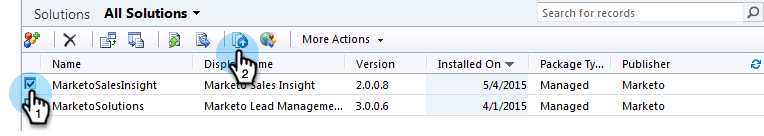
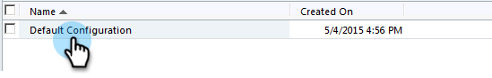
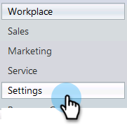
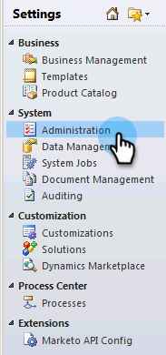

# 在Microsoft Dynamics 2011中安装和配置Marketo Sales Insight {#install-and-configure-marketo-sales-insight-in-microsoft-dynamics}

Marketo Sales Insight是您销售团队的一个非常棒的工具。 以下分步说明如何在Microsoft Dynamics 2011内部部署中安装和配置内部部署。

>[!PREREQUISITES]
>
>完成Marketo-Microsoft集成。
>
>[下载正确的解决方案](/help/marketo/product-docs/marketo-sales-insight/msi-for-microsoft-dynamics/installing/download-the-marketo-sales-insight-solution-for-microsoft-dynamics.md) 适用于您的Microsoft Dynamics CRM版本。

## 导入解决方案 {#import-solution}

1. 登录到Microsoft Dynamics CRM。 单击 **设置** ，位于左下角菜单中。

   

1. 选择 **解决方案** 在树上。

   

1. 单击 **导入** ( )。

   

   >[!NOTE]
   >
   >您应该已经拥有 [已安装并配置](/help/marketo/product-docs/marketo-sales-insight/msi-for-microsoft-dynamics/installing/install-and-configure-marketo-sales-insight-in-microsoft-dynamics-2011.md) Marketo解决方案。

1. 单击 **浏览**. 为您选择Marketo Sales Insight解决方案 [已下载](/help/marketo/product-docs/marketo-sales-insight/msi-for-microsoft-dynamics/installing/download-the-marketo-sales-insight-solution-for-microsoft-dynamics.md). 单击 **下一个**.

   

1. 验证解决方案的详细信息，然后单击 **下一个**.

   

1. 确保选中SDK消息选项。 单击 **下一个**.

   

1. 现在等待导入完成。

   

1. 单击&#x200B;**关闭**。

   

1. Marketo Sales Insight现在将显示在解决方案列表中。 好耶！

   

1. 选择Marketo Sales Insight ，然后单击 **发布所有自定义项** ( )。

   

## 连接Marketo和Sales Insight  {#connect-marketo-and-sales-insight}

>[!NOTE]
>
>**需要管理员权限**

1. 登录Marketo并单击 **管理员**.

   

1. 在 **销售分析** 部分单击 **编辑API配置**.

   

1. 复制 **Marketo主机**， **API URL**、和 **API用户ID** 以便在以后的步骤中使用。 输入 **API密钥** ，然后单击 **保存**.

   >[!CAUTION]
   >
   >请勿在API密钥中使用&amp;符号。

   

   >[!NOTE]
   >
   >以下字段必须与Marketo同步， _潜在客户和联系人_ 让Sales Insight发挥作用：
   >
   >* 优先级
   >* 紧急
   >* 相对分数
   >
   >如果缺少这些字段中的任何一个，您将在Marketo中看到一条错误消息，其中包含缺少的字段的名称。 要解决此问题，请执行 [此过程](/help/marketo/product-docs/marketo-sales-insight/msi-for-microsoft-dynamics/setting-up-and-using/required-fields-for-syncing-marketo-with-dynamics.md).

1. 返回到Dynamics，选择 **设置**.

   

1. 选择 **Marketo API配置** 在树上。

   

1. 单击 **默认配置**.

   

1. 输入您之前从Marketo获取的信息。

   

1. 单击 **保存**.

   

## 设置用户访问权限 {#set-user-access}

设置用户角色以授予特定用户访问Sales Insight的权限。

1. 选择 **设置**.

   

1. 选择 **管理** 在树上。

   

1. 单击 **用户**.

   

1. 选择要向其授予访问权限的用户，然后单击 **管理角色**.

   

1. 选择 **Marketo Sales Insight** 角色并单击 **确定**.

   

   就是这样！ 现在，所有有权访问的用户都可以在潜在客户/联系人详细信息视图中查看销售分析部分。

   

   恭喜！ 您现在已释放了Marketo Sales Insight的强大功能。

>[!MORELIKETHIS]
>
>[为潜在客户/联系人记录设置星星和火焰](/help/marketo/product-docs/marketo-sales-insight/msi-for-microsoft-dynamics/setting-up-and-using/setting-up-stars-and-flames-for-lead-contact-records.md)
