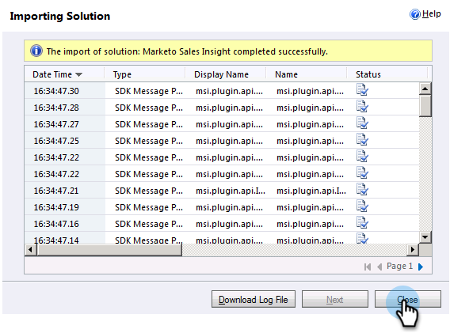

# 在[!DNL Marketo Sales Insight]中安装和配置[!DNL Microsoft Dynamics 2011] {#install-and-configure-marketo-sales-insight-in-microsoft-dynamics}

[!DNL Marketo Sales Insight]是您销售团队的绝佳工具。 以下分步说明如何在[!DNL Microsoft Dynamics 2011]内部部署中安装和配置它。

>[!PREREQUISITES]
>
>完成Marketo-Microsoft集成。
>
>[为您的](/help/marketo/product-docs/marketo-sales-insight/msi-for-microsoft-dynamics/installing/download-the-marketo-sales-insight-solution-for-microsoft-dynamics.md) CRM版本下载正确的解决方案[!DNL Microsoft Dynamics]。

## 导入解决方案 {#import-solution}

1. 登录到[!DNL Microsoft Dynamics] CRM。 单击左下角菜单中的&#x200B;**[!UICONTROL Settings]**。

   

1. 在树中选择&#x200B;**[!UICONTROL Solutions]**。

   

1. 单击&#x200B;**导入** ()。

   

   >[!NOTE]
   >
   >在继续之前，您应该已经安装并配置了[Marketo解决方案](/help/marketo/product-docs/marketo-sales-insight/msi-for-microsoft-dynamics/installing/install-and-configure-marketo-sales-insight-in-microsoft-dynamics-2011.md)。

1. 单击&#x200B;**[!UICONTROL Browse]**。 选择您[!DNL Marketo Sales Insight]下载的[解决方案](/help/marketo/product-docs/marketo-sales-insight/msi-for-microsoft-dynamics/installing/download-the-marketo-sales-insight-solution-for-microsoft-dynamics.md)。 单击 **[!UICONTROL Next]**。

   

1. 验证解决方案的详细信息，然后单击&#x200B;**[!UICONTROL Next]**。

   

1. 确保选中SDK消息选项。 单击 **[!UICONTROL Next]**。

   

1. 现在等待导入完成。

   

1. 单击 **[!UICONTROL Close]**。

   

1. [!DNL Marketo Sales Insight]现在将显示在解决方案列表中。 好耶！

   

1. 选择[!DNL Marketo Sales Insight]并单击&#x200B;**发布所有自定义项** ( )。

   

## 连接Marketo和Sales Insight  {#connect-marketo-and-sales-insight}

>[!NOTE]
>
>**需要管理员权限**

1. 登录到Marketo并单击&#x200B;**[!UICONTROL Admin]**。

   

1. 在&#x200B;**[!UICONTROL Sales Insight]**&#x200B;部分下，单击&#x200B;**[!UICONTROL Edit API Configuration]**。

   

1. 复制&#x200B;**[!UICONTROL Marketo Host]**、**[!UICONTROL API URL]**&#x200B;和&#x200B;**[!UICONTROL API User Id]**&#x200B;以供稍后步骤使用。 输入您选择的&#x200B;**[!UICONTROL API Secret Key]**&#x200B;并单击&#x200B;**[!UICONTROL Save]**。

   >[!CAUTION]
   >
   >请勿在API密钥中使用&amp;符号。

   

   >[!NOTE]
   >
   >以下字段必须与Marketo同步，_潜在客户和联系人_&#x200B;才能使Sales Insight正常工作：
   >
   >* 优先级
   >* 紧急
   >* 相对分数
   >
   >如果缺少这些字段中的任何一个，您将在Marketo中看到一条错误消息，其中包含缺少的字段的名称。 若要解决此问题，请执行[此过程](/help/marketo/product-docs/marketo-sales-insight/msi-for-microsoft-dynamics/setting-up-and-using/required-fields-for-syncing-marketo-with-dynamics.md)。

1. 返回到Dynamics，选择&#x200B;**[!UICONTROL Settings]**。

   

1. 在树中选择&#x200B;**[!UICONTROL Marketo API Config]**。

   

1. 单击 **[!UICONTROL Default Configuration]**。

   

1. 输入您之前从Marketo获取的信息。

   

1. 单击 **[!UICONTROL Save]**。

   

## 设置用户访问权限 {#set-user-access}

设置用户角色以授予特定用户访问[!DNL Sales Insight]的权限。

1. 选择 **[!UICONTROL Settings]**。

   

1. 在树中选择&#x200B;**[!UICONTROL Administration]**。

   

1. 单击 **[!UICONTROL Users]**。

   

1. 选择要向其授予访问权限的用户，然后单击&#x200B;**[!UICONTROL Manage Roles]**。

   

1. 选择&#x200B;**[!UICONTROL Marketo Sales Insight]**&#x200B;角色并单击&#x200B;**[!UICONTROL OK]**。

   

   就是这样！ 现在，所有具有访问权限的用户都可以在潜在客户/联系人详细信息视图中看到sales insight部分。

   

   恭喜！ 您现在已释放[!DNL Marketo Sales Insight]的力量。

>[!MORELIKETHIS]
>
>[为潜在客户/联系人记录设置星星和火焰](/help/marketo/product-docs/marketo-sales-insight/msi-for-microsoft-dynamics/setting-up-and-using/setting-up-stars-and-flames-for-lead-contact-records.md)
