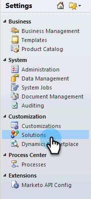

# 在Microsoft Dynamics 2011 {#install-and-configure-marketo-sales-insight-in-microsoft-dynamics}中安装和配置Marketo Sales Insight

Marketo Sales Insight是一款适合您的销售团队的绝佳工具。 以下是如何在Microsoft Dynamics 2011内部部署中安装和配置它的分步说明。

>[!PREREQUISITES]
>
>完成Marketo-Microsoft集成。
>
>[下载适用于](/help/marketo/product-docs/marketo-sales-insight/msi-for-microsoft-dynamics/installing/download-the-marketo-sales-insight-solution-for-microsoft-dynamics.md) 您版本的Microsoft Dynamics CRM的正确解决方案。

## 导入解决方案{#import-solution}

1. 登录到Microsoft Dynamics CRM。 单击左下角菜单中的&#x200B;**设置**。

   

1. 在树中选择&#x200B;**解决方案**。

   

1. 单击&#x200B;**导入**()。

   

   >[!NOTE]
   >
   >在前进之前，您应该已经安装并配置了[ Marketo解决方案。](/help/marketo/product-docs/marketo-sales-insight/msi-for-microsoft-dynamics/installing/install-and-configure-marketo-sales-insight-in-microsoft-dynamics-2011.md)

1. 单击&#x200B;**浏览**。 选择您[downloaded](/help/marketo/product-docs/marketo-sales-insight/msi-for-microsoft-dynamics/installing/download-the-marketo-sales-insight-solution-for-microsoft-dynamics.md)的Marketo Sales Insight解决方案。 单击&#x200B;**下一步**。

   

1. 验证解决方案的详细信息，然后单击&#x200B;**下一步**。

   

1. 确保选中SDK消息选项。 单击&#x200B;**下一步**。

   

1. 现在，等待导入完成。

   

1. 单击&#x200B;**关闭**。

   

1. Marketo Sales Insight现在将显示在解决方案列表中。 耶！

   

1. 选择Marketo Sales Insight，然后单击&#x200B;**发布所有自定义项**()。

   

## Connect Marketo和Sales Insight {#connect-marketo-and-sales-insight}

>[!NOTE]
>
>**需要管理权限**

1. 登录到Marketo，然后单击&#x200B;**管理**。

   

1. 在&#x200B;**Sales Insight**&#x200B;部分下，单击&#x200B;**编辑API配置**。

   

1. 复制&#x200B;**Marketo Host**、**API URL**&#x200B;和&#x200B;**API用户Id**，以在后续步骤中使用。 输入您选择的&#x200B;**API密钥**，然后单击&#x200B;**保存**。

   >[!CAUTION]
   >
   >请勿在API密钥中使用&amp;号。

   

   >[!NOTE]
   >
   >以下字段必须与Marketo同步，以使&#x200B;_和Contact_&#x200B;的Sales Insight能够正常工作：
   >
   >* 优先级
   >* 紧急
   >* 相对得分

   >
   >如果缺少其中任何字段，您将在Marketo中看到一条错误消息，其中包含缺少字段的名称。 要解决此问题，请执行[此过程](/help/marketo/product-docs/marketo-sales-insight/msi-for-microsoft-dynamics/setting-up-and-using/required-fields-for-syncing-marketo-with-dynamics.md)。

1. 返回至Dynamics，选择&#x200B;**设置**。

   

1. 在树中选择&#x200B;**Marketo API Config**。

   

1. 单击&#x200B;**默认配置**。

   

1. 输入您从Marketo之前获取的信息。

   

1. 单击&#x200B;**保存**。

   

## 设置用户访问{#set-user-access}

设置用户角色，以授予特定用户对Sales Insight的访问权限。

1. 选择&#x200B;**设置**。

   

1. 在树中选择&#x200B;**管理**。

   

1. 单击&#x200B;**用户**。

   

1. 选择要授予访问权限的用户，然后单击&#x200B;**管理角色**。

   

1. 选择&#x200B;**Marketo Sales Insight**&#x200B;角色，然后单击&#x200B;**确定**。

   

   就这样！ 所有具有访问权限的用户现在都可以查看潜在客户/联系人详细信息视图中的销售分析部分。

   

   祝贺你。 您现在已释放了Marketo Sales Insight的力量。

>[!MORELIKETHIS]
>
>[为潜在客户/联系人记录设置星星和火焰](/help/marketo/product-docs/marketo-sales-insight/msi-for-microsoft-dynamics/setting-up-and-using/setting-up-stars-and-flames-for-lead-contact-records.md)
