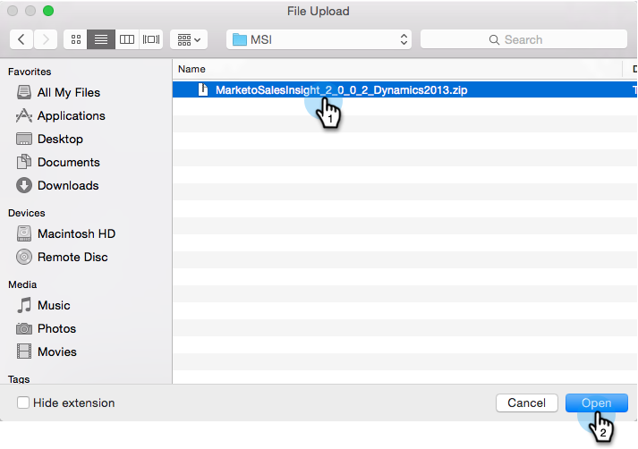
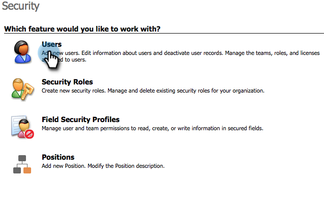

# 在Microsoft Dynamics 2015中安装和配置Marketo Sales Insight {#install-and-configure-marketo-sales-insight-in-microsoft-dynamics}

Marketo Sales Insight是一款非常棒的工具，可让您的销售团队更好地了解营销团队所拥有的丰富数据。 以下是如何在Microsoft Dynamics 201中安装和配置它

>[!PREREQUISITES]
>
>完成Marketo-Microsoft集成。
>
>[下载正确的解决方案](/help/marketo/product-docs/marketo-sales-insight/msi-for-microsoft-dynamics/installing/download-the-marketo-sales-insight-solution-for-microsoft-dynamics.md) ，以获取Microsoft Dynamics CRM版本的信息。

## 导入解决方案 {#import-solution}

好，现在该将Marketo Sales Insight解决方案导入Microsoft Dynamics。 以下是操作方法：

1. 在Microsoft Dynamics CRM下，单击 **设置**.

   

1. 在设置下，单击 **自定义**.

   

1. 单击 **解决方案**.

   

   >[!NOTE]
   >
   >在前进之前，您应该已经安装并配置了Marketo解决方案。

1. 单击 **导入**.

   

1. 在新窗口中，单击 **浏览**.

   

1. 查找并选择您在上面下载的解决方案。

   

1. 单击 **下一个**.

   

1. 解决方案将上传。 您可以根据需要查看包内容。 单击 **下一个**.

   

1. 确保选中该框并单击 **导入**.

   

1. 请随时下载日志文件，然后单击 **关闭**.

   

1. 太棒了！ 您应该现在看到解决方案。 如果它不在，请刷新屏幕。

   

## 连接Marketo和Sales Insight {#connect-marketo-and-sales-insight}

让我们将您的Marketo实例绑定到Dynamics中的Sales Insight。 以下是操作方法：

>[!NOTE]
>
>需要管理员权限。

1. 登录Marketo并转到 **管理员** 中。

   

1. 在“销售分析”部分下，单击 **编辑API配置**.

   

1. 复制 **Marketo名嘴**, **API URL**&#x200B;和 **API用户Id** 以供在后续步骤中使用。 输入您选择的API密钥，然后单击 **保存**.

   >[!CAUTION]
   >
   >请勿在API密钥中使用与号(&amp;)。

   

   >[!NOTE]
   >
   >以下字段必须与Marketo同步，以便 *潜在客户和联系人* 以便Sales Insight正常工作：
   >
   >* 优先级
   >* 紧急
   >* 相对分数

   >
   >如果这些字段中有任何字段缺失，您将在Marketo中看到一条错误消息，其中包含缺少字段的名称。 要修复此问题，请执行 [此过程](/help/marketo/product-docs/marketo-sales-insight/msi-for-microsoft-dynamics/setting-up-and-using/required-fields-for-syncing-marketo-with-dynamics.md).

1. 返回Microsoft Dynamics，转到 **设置**.

   

1. 在 **设置**，单击 **Marketo API配置**.

   

1. 单击 **新建**.

   

1. 输入您之前从Marketo获取的信息，然后单击 **保存**.

   

## 设置用户访问权限 {#set-user-access}

最后，您必须授予特定用户使用Marketo Sales Insight的权限。

1. 转到 **设置**.

   

1. 转到 **安全性**.

   

1. 单击 **用户**.

   

1. 选择要授予对Sales Insight的访问权限的用户，然后单击 **管理角色**.

   

1. 选择Marketo Sales Insight角色并单击 **确定**.

   

   你们该完蛋了！ 最后，要进行测试，请以有权访问Marketo Sales Insight的用户身份登录Dynamics，并查看潜在客户或联系人。

   

您现在已为您的销售团队释放了Marketo Sales Insight的功能。

>[!MORELIKETHIS]
>
>[为潜在客户/联系人记录设置星形和火焰](/help/marketo/product-docs/marketo-sales-insight/msi-for-microsoft-dynamics/setting-up-and-using/setting-up-stars-and-flames-for-lead-contact-records.md)
