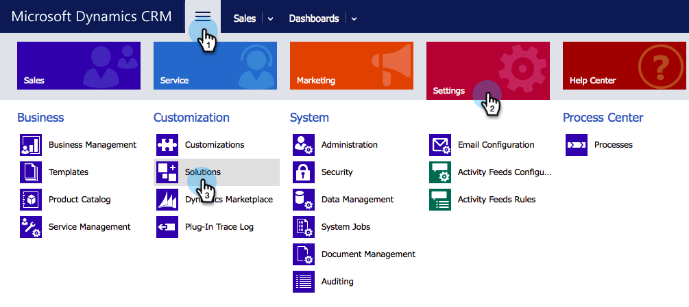

# 在Microsoft Dynamics 365中安装和配置Marketo Sales Insight {#install-and-configure-marketo-sales-insight-in-microsoft-dynamics}

Marketo Sales Insight是一个非常棒的工具，可为您的销售团队提供一个窗口，让您了解营销团队拥有的大量数据。 以下是如何安装和配置的。

>[!PREREQUISITES]
>
>完成Marketo-Microsoft集成。
>
>[下载正确的解决方案](/help/marketo/product-docs/marketo-sales-insight/msi-for-microsoft-dynamics/installing/download-the-marketo-sales-insight-solution-for-microsoft-dynamics.md) 适用于您的Microsoft Dynamics CRM版本。

## 导入解决方案 {#import-solution}

1. 登录 [Microsoft Office 365](https://login.microsoftonline.com/).

   

1. 单击  菜单并选择 **CRM**.

   

1. 单击  菜单。 在下拉菜单中，选择 **设置**，然后选择 **解决方案**.

   

   >[!NOTE]
   >
   >您应该已经拥有 [已安装和配置Marketo解决方案](/help/marketo/product-docs/crm-sync/microsoft-dynamics-sync/sync-setup/microsoft-dynamics-365-with-ropc-connection/step-1-of-4-install.md) 在继续下一步之前。

1. 单击 **导入**.

   

1. 在新窗口中，单击 **浏览**. 选择 [您在步骤1下载的Marketo Sales Insight解决方案](#msi). 单击 **下一个**.

   

1. 将上传解决方案。 您可以根据需要查看包内容。 单击 **下一个**.

   

1. 请务必离开此框 **已选中** 并单击 **导入**.

   

1. 欢迎您随时下载日志文件。 单击&#x200B;**关闭**。

   

1. 太棒了！ 您现在应该可以看到解决方案。 如果不存在，请刷新屏幕。

   

1. 单击 **发布所有自定义项**.

   

## 连接Marketo和Sales Insight {#connect-marketo-and-sales-insight}

让我们将您的Marketo实例关联到Dynamics中的Sales Insight。 方法如下：

>[!NOTE]
>
>**需要管理员权限**

1. 登录Marketo并转到 **管理员** 部分。

   

1. 在 **销售分析** 部分，单击 **编辑API配置**.

   

1. 复制 **Marketo主机**， **API URL** 和 **API用户ID** 以便在后续步骤中使用。 输入 **API密钥** ，然后单击 **保存**.

   >[!CAUTION]
   >
   >请勿在API密钥中使用&amp;符号。

   

   >[!NOTE]
   >
   >以下字段必须与Marketo同步 _潜在客户和联系人_ 让Sales Insight发挥作用：
   >
   > * 优先级
   > * 紧急
   > * 相对分数
   >
   >如果缺少其中任何字段，您将在Marketo中看到一条错误消息，其中包含缺少的字段的名称。 要解决此问题，请执行 [此过程](/help/marketo/product-docs/marketo-sales-insight/msi-for-microsoft-dynamics/setting-up-and-using/required-fields-for-syncing-marketo-with-dynamics.md).

1. 返回到Microsoft Dynamics，单击  图标，然后选择 **Marketo API配置** 在下拉菜单中。

   

1. 单击 **默认配置**.

   

1. 输入您之前从Marketo复制的信息。

   

1. 单击  图标以保存更改。

## 设置用户访问权限 {#set-user-access}

您需要授予用户使用Sales Insight的权限。

1. 单击  菜单。 在下拉菜单中，选择 **设置**，然后选择 **安全性**.

   

1. 单击 **用户**.

   

1. 选择要向授予Sales Insight访问权限的用户，然后单击 **管理角色**.

   

1. 选择 **Marketo Sales Insight** 角色并单击 **确定**.

   

   你该做完了！ 最后，要进行测试，请以有权访问Marketo Sales Insight的用户身份登录Dynamics，并查看潜在客户或联系人。

   

您现在已为销售团队解锁了Marketo Sales Insight的强大功能。

>[!MORELIKETHIS]
>
>[为潜在客户/联系人记录设置星星和火焰](/help/marketo/product-docs/marketo-sales-insight/msi-for-microsoft-dynamics/setting-up-and-using/setting-up-stars-and-flames-for-lead-contact-records.md)
