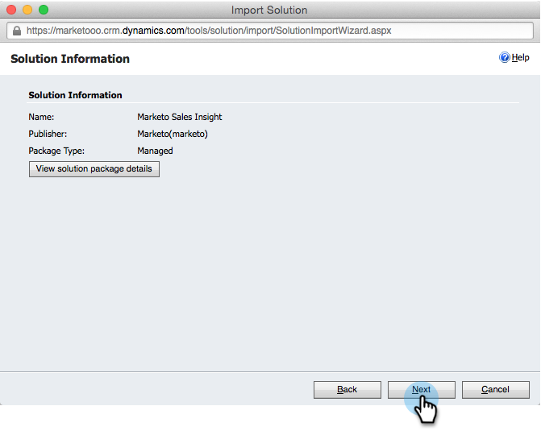

# 在[!DNL Marketo Sales Insight]中安装和配置[!DNL Microsoft Dynamics 365] {#install-and-configure-marketo-sales-insight-in-microsoft-dynamics}

[!DNL Marketo Sales Insight]是一个非常棒的工具，可为您的销售团队提供一个了解营销团队所拥有大量数据的“窗口”。 以下是如何安装和配置的。

>[!PREREQUISITES]
>
>完成Marketo-Microsoft集成。
>
>[为您的](/help/marketo/product-docs/marketo-sales-insight/msi-for-microsoft-dynamics/installing/download-the-marketo-sales-insight-solution-for-microsoft-dynamics.md)版本下载正确的解决方案[!DNL Microsoft Dynamics CRM]。

## 导入解决方案 {#import-solution}

1. 登录到[[!DNL Microsoft Office 365]](https://login.microsoftonline.com/)。

   

1. 单击菜单并选择&#x200B;**CRM**。

   

1. 单击菜单。 在下拉列表中，选择&#x200B;**[!DNL Settings]**，然后选择&#x200B;**[!DNL Solutions]**。

   

   >[!NOTE]
   >
   >在继续之前，您应该已经安装和配置了[Marketo解决方案](/help/marketo/product-docs/crm-sync/microsoft-dynamics-sync/sync-setup/microsoft-dynamics-365-with-ropc-connection/step-1-of-4-install.md)。

1. 单击 **[!UICONTROL Import]**。

   

1. 在新窗口中，单击&#x200B;**[!UICONTROL Browse]**。 选择您在步骤1[中下载的](#msi)Marketo Sales Insight解决方案。 单击 **[!UICONTROL Next]**。

   

1. 将上传解决方案。 您可以查看文件包的内容（如果需要）。 单击 **[!UICONTROL Next]**。

   

1. 确保离开框&#x200B;**[!UICONTROL checked]**&#x200B;并单击&#x200B;**[!UICONTROL Import]**。

   

1. 您可以随时下载日志文件。 单击 **[!UICONTROL Close]**。

   

1. 太棒了！ 您现在应该看到解决方案。 如果不存在，请刷新屏幕。

   

1. 单击 **[!UICONTROL Publish All Customizations]**。

   

## 连接Marketo和[!DNL Sales Insight] {#connect-marketo-and-sales-insight}

让我们在[!DNL Sales Insight]中将您的Marketo实例关联到[!DNL Dynamics]。 方法如下：

>[!NOTE]
>
>**需要管理员权限**

1. 登录Marketo并转到&#x200B;**[!UICONTROL Admin]**&#x200B;部分。

   

1. 在&#x200B;**[!UICONTROL Sales Insight]**&#x200B;部分下，单击&#x200B;**编辑API配置**。

   

1. 复制&#x200B;**[!UICONTROL Marketo Host]**、**[!UICONTROL API URL]**&#x200B;和&#x200B;**[!UICONTROL API User Id]**&#x200B;以供稍后步骤使用。 输入您选择的&#x200B;**[!UICONTROL API Secret Key]**&#x200B;并单击&#x200B;**[!UICONTROL Save]**。

   >[!CAUTION]
   >
   >请勿在API密钥中使用&amp;符号。

   

   >[!NOTE]
   >
   >以下字段必须与Marketo同步，_潜在客户和联系人_&#x200B;才能使[!DNL Sales Insight]正常工作：
   >
   > * 优先级
   > * 紧急
   > * 相对分数
   >
   >如果缺少这些字段中的任何一个，您将在Marketo中看到一条错误消息，其中包含缺少的字段的名称。 若要解决此问题，请执行[此过程](/help/marketo/product-docs/marketo-sales-insight/msi-for-microsoft-dynamics/setting-up-and-using/required-fields-for-syncing-marketo-with-dynamics.md)。

1. 返回[!DNL Microsoft Dynamics]，单击旁边的[!UICONTROL Settings]图标，然后在下拉列表中选择&#x200B;**[!UICONTROL Marketo API Config]**。

   

1. 单击 **[!UICONTROL Default Configuration]**。

   

1. 输入您之前从Marketo复制的信息。

   

1. 单击右下角的图标以保存更改。

## 设置用户访问权限 {#set-user-access}

您需要授予用户使用[!DNL Sales Insight]的权限。

1. 单击菜单。 在下拉菜单中选择&#x200B;**[!UICONTROL Settings]**，然后选择&#x200B;**[!UICONTROL Security]**。

   

1. 单击 **[!UICONTROL Users]**。

   

1. 选择要授予[!DNL Sales Insight]访问权限的用户，然后单击&#x200B;**[!UICONTROL Manage Roles]**。

   

1. 选择&#x200B;**[!UICONTROL Marketo Sales Insight]**&#x200B;角色并单击&#x200B;**[!UICONTROL OK]**。

   

   你应该都做完了！ 最后，要进行测试，请以有权访问[!DNL Dynamics]的用户身份登录[!DNL Marketo Sales Insight]并查看潜在客户或联系人。

   

您现在已为销售团队解锁[!DNL Marketo Sales Insight]的强大功能。

>[!MORELIKETHIS]
>
>[为潜在客户/联系人记录设置星星和火焰](/help/marketo/product-docs/marketo-sales-insight/msi-for-microsoft-dynamics/setting-up-and-using/setting-up-stars-and-flames-for-lead-contact-records.md)
