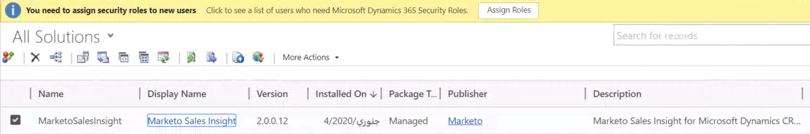
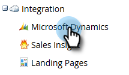

# 在Microsoft Dynamics Online中安装和配置Marketo Sales Insight {#install-and-configure-marketo-sales-insight-in-microsoft-dynamics-online}

Marketo Sales Insight是一个非常棒的工具，可为您的销售团队提供一个窗口，让您了解营销团队拥有的大量数据。 以下说明如何在Microsoft Dynamics Online中安装和配置它。

>[!PREREQUISITES]
>
>完成Marketo-Microsoft集成。
>
>[下载正确的解决方案](/help/marketo/product-docs/marketo-sales-insight/msi-for-microsoft-dynamics/installing/download-the-marketo-sales-insight-solution-for-microsoft-dynamics.md) 适用于您的Microsoft Dynamics CRM版本。

## 导入解决方案 {#import-solution}

>[!NOTE]
>
>如果您使用的是统一界面，请在下面的步骤1之前，单击右上角的设置图标，然后选择 **高级设置**.

1. 在Microsoft Dynamics CRM下，单击 **设置**.

   

1. 在设置下，单击 **自定义**.

   

1. 单击 **解决方案**.

   

   >[!NOTE]
   >
   >在继续下一步操作之前，您应该已经安装和配置了Marketo解决方案。

1. 单击 **导入**.

   

1. 在新窗口中，单击 **浏览**.

   

1. 在您的计算机上，查找并安装刚刚下载的解决方案。

1. 单击 **下一个**.

   

1. 将上传解决方案。 您可以根据需要查看包内容。 单击 **下一个**.

   

1. 确保选中此框，然后单击 **导入**.

   

1. 请随时下载日志文件，然后单击 **关闭**.

   

1. 太棒了！ 您现在应该可以看到解决方案。 如果不存在，请刷新屏幕。

   

1. 单击 **发布自定义**.

   >[!NOTE]
   >
   >确保启用全局MS Dynamics同步。

## 连接Marketo和Sales Insight {#connect-marketo-and-sales-insight}

让我们将您的Marketo实例关联到Dynamics中的Sales Insight。 方法如下：

>[!NOTE]
>
>**需要管理员权限**

1. 登录Marketo并转到 **管理员** 部分。

   

1. 在销售分析部分下，单击 **编辑API配置**.

   

1. 复制 **Marketo主机**， **API URL**、和 **API用户ID** 以便在后续步骤中使用。 输入您选择的API密钥，然后单击 **保存**.

   >[!CAUTION]
   >
   >请勿在API密钥中使用&amp;符号。

   

   >[!NOTE]
   >
   >以下字段必须与Marketo同步 _潜在客户和联系人_ 让Sales Insight发挥作用：
   >
   >* 优先级
   >* 紧急
   >* 相对分数
   >
   >如果缺少其中任何字段，您将在Marketo中看到一条错误消息，其中包含缺少的字段的名称。 要解决此问题，请执行 [此过程](/help/marketo/product-docs/marketo-sales-insight/msi-for-microsoft-dynamics/setting-up-and-using/required-fields-for-syncing-marketo-with-dynamics.md).

1. 返回Microsoft Dynamics，转到 **设置**.

   

1. 下 **设置**，单击 **Marketo API配置**.

   

1. 单击 **新**.

   

1. 输入您之前从Marketo获取的信息，然后单击 **保存**.

   

## 启用同步 {#enable-sync}

1. 在Marketo中，单击 **管理员**.

   

1. 在集成下，选择 **Microsoft Dynamics**.

   

1. 单击 **启用同步**.

   

1. 单击 **编辑** “字段同步详细信息”旁边。

   

1. 这将 _自动_ 选择之前禁用的MSI字段（“紧急程度”、“相对分数”和“优先级”）。 只需单击 **保存** 以开始同步数据。

   

## 设置用户访问权限 {#set-user-access}

最后，您必须授予特定用户使用Marketo Sales Insight的权限。

1. 转到 **设置**.

   

1. 转到 **安全性**.

   

1. 单击 **用户**.

   

1. 选择您要授予Sales Insight访问权限的用户，然后单击 **管理角色**.

   

1. 选择Marketo Sales Insight角色并单击 **确定**.

   

   你该做完了！ 最后，要进行测试，请以有权访问Marketo Sales Insight的用户身份登录Dynamics，并查看潜在客户或联系人。

   

>[!MORELIKETHIS]
>
>[为潜在客户/联系人记录设置星星和火焰](/help/marketo/product-docs/marketo-sales-insight/msi-for-microsoft-dynamics/setting-up-and-using/setting-up-stars-and-flames-for-lead-contact-records.md)
