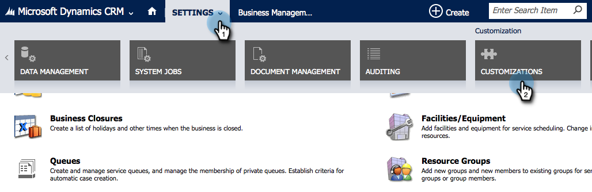

# 在Microsoft Dynamics Online {#install-and-configure-marketo-sales-insight-in-microsoft-dynamics-online}中安装和配置Marketo Sales Insight

Marketo Sales Insight是一款绝佳的工具，可让您的销售团队“了解”营销团队拥有的大量数据。 下面介绍如何在Microsoft Dynamics Online中安装和配置它。

>[!PREREQUISITES]
>
>完成Marketo-Microsoft集成。
>
>[下载适用于](/help/marketo/product-docs/marketo-sales-insight/msi-for-microsoft-dynamics/installing/download-the-marketo-sales-insight-solution-for-microsoft-dynamics.md) 您版本的Microsoft Dynamics CRM的正确解决方案。

## 导入解决方案{#import-solution}

>[!NOTE]
>
>如果您使用的是统一接口，请在下面的步骤1之前，单击右上角的“设置”图标，然后选择&#x200B;**高级设置**。

1. 在Microsoft Dynamics CRM下，单击&#x200B;**设置**。

   

1. 在“设置”下，单击&#x200B;**自定义**。

   

1. 单击&#x200B;**解决方案**。

   

   >[!NOTE]
   >
   >在前进之前，您应已安装并配置Marketo解决方案。

1. 单击&#x200B;**导入**。

   

1. 在新窗口中，单击&#x200B;**浏览**。

   

1. 在您的计算机上，找到并安装您刚下载的解决方案。

1. 单击&#x200B;**下一步**。

   

1. 解决方案将上传。 您可以视图包内容（如果需要）。 单击&#x200B;**下一步**。

   

1. 确保选中该框，然后单击&#x200B;**导入**。

   

1. 请随时下载日志文件，然后单击&#x200B;**关闭**。

   

1. 太棒了！ 你现在应该看到解决方案。 如果它不在，请刷新您的屏幕。

   

1. 单击&#x200B;**发布自定义**。

   >[!NOTE]
   >
   >确保启用全局MS Dynamics同步。

## Connect Marketo和Sales Insight {#connect-marketo-and-sales-insight}

让我们将您的Marketo实例与Dynamics中的Sales Insight绑定。 下面介绍如何：

>[!NOTE]
>
>**需要管理权限**

1. 登录Marketo并转到&#x200B;**Admin**&#x200B;部分。

   

1. 在Sales Insight部分下，单击&#x200B;**编辑API配置**。

   

1. 复制&#x200B;**Marketo Host**、**API URL**&#x200B;和&#x200B;**API用户Id**，以在后续步骤中使用。 输入您选择的API密钥，然后单击&#x200B;**保存**。

   >[!CAUTION]
   >
   >请勿在API密钥中使用&amp;号。

   

   >[!NOTE]
   >
   >以下字段必须与Marketo同步，以使&#x200B;_和Contact_&#x200B;的Sales Insight能够正常工作：
   >
   >* 优先级
   >* 紧急
   >* 相对得分

   >
   >如果缺少其中任何字段，您将在Marketo中看到一条错误消息，其中包含缺少字段的名称。 要解决此问题，请执行[此过程](/help/marketo/product-docs/marketo-sales-insight/msi-for-microsoft-dynamics/setting-up-and-using/required-fields-for-syncing-marketo-with-dynamics.md)。

1. 返回至Microsoft Dynamics，转至&#x200B;**设置**。

   

1. 在&#x200B;**Settings**&#x200B;下，单击&#x200B;**Marketo API配置**。

   

1. 单击&#x200B;**新建**。

   

1. 输入您从Marketo之前获取的信息，然后单击&#x200B;**保存**。

   

## 启用同步{#enable-sync}

1. 在Marketo中，单击&#x200B;**管理员**。

   

1. 在“集成”下，选择&#x200B;**Microsoft Dynamics**。

   

1. 单击&#x200B;**启用同步**。

   

1. 单击“字段同步详细信息”旁边的&#x200B;**编辑**。

   

1. 这将&#x200B;_自动_&#x200B;选择之前禁用的MSI字段（紧急程度、相对得分和优先级）。 只需单击&#x200B;**保存**&#x200B;即可开始同步数据。

   

## 设置用户访问{#set-user-access}

最后，您必须授予特定用户使用Marketo Sales Insight的权限。

1. 转到&#x200B;**设置**。

   

1. 转至&#x200B;**Security**。

   

1. 单击&#x200B;**用户**。

   

1. 选择要授予对Sales Insight访问权限的用户，然后单击&#x200B;**管理角色**。

   

1. 选择Marketo Sales Insight角色，然后单击&#x200B;**确定**。

   

   你们该做完！ 最后，要进行测试，请以有权访问Marketo Sales Insight并查看潜在客户或联系人的用户身份登录Dynamics。

   

>[!MORELIKETHIS]
>
>[为潜在客户/联系人记录设置星星和火焰](/help/marketo/product-docs/marketo-sales-insight/msi-for-microsoft-dynamics/setting-up-and-using/setting-up-stars-and-flames-for-lead-contact-records.md)
