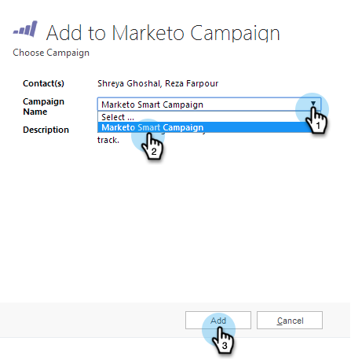

# 将潜在客户/联系人从[!DNL Microsoft Dynamics]添加到Marketo营销活动 {#add-a-lead-contact-to-a-marketo-campaign-from-microsoft-dynamics}

您可以在[!DNL Microsoft Dynamics]中直接将潜在客户/联系人快速轻松地添加到Marketo智能营销活动中。 操作方法如下：

1. 在[!DNL Dynamics]中，转到&#x200B;**[!UICONTROL Sales]**&#x200B;区域。

   

1. 选择一个视图。

   

1. 选择一个或多个潜在客户或联系人。

   

1. 单击&#x200B;**...**&#x200B;并选择&#x200B;**[!UICONTROL Add to Marketo Campaign]**。

   

1. 选择要添加潜在客户或联系人的Marketo营销活动，然后单击&#x200B;**[!UICONTROL Add]**。

   

   >[!NOTE]
   >
   >要使营销活动显示在下拉列表中，请在设置营销活动时，使用&#x200B;[**Campaign is Requested** trigger](/help/marketo/product-docs/core-marketo-concepts/smart-campaigns/using-smart-campaigns/setting-up-a-trigger-smart-campaign-for-sales-using-campaign-is-requested.md)，并将[!DNL Sales Insight]作为源。

大家就这些！ 您现在可以直接从[!DNL Dynamics]手中获得Marketo智能营销活动的强大功能。
