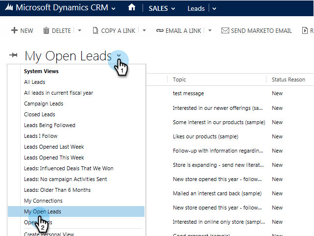

# 从Microsoft Dynamics向Marketo促销活动添加潜在客户/联系人 {#add-a-lead-contact-to-a-marketo-campaign-from-microsoft-dynamics}

您可以直接从Microsoft Dynamics中快速轻松地将潜在客户/联系人添加到Marketo智能营销活动。 这是方法。

1. 在Dynamics中，转到 **销售** 的上界。

   

1. 选择一个视图。

   

1. 选择一个或多个潜在客户或联系人。

   

1. 单击 **...** 选择 **添加到Marketo Campaign**.

   

1. 选择要将潜在客户或联系人添加到的Marketo促销活动，然后单击 **添加**.

   

   >[!NOTE]
   >
   >要使营销活动显示在下拉列表中，请使用  [**请求营销活动** 触发器](/help/marketo/product-docs/core-marketo-concepts/smart-campaigns/using-smart-campaigns/setting-up-a-trigger-smart-campaign-for-sales-using-campaign-is-requested.md)，并将Sales Insight作为源。

这就是所有人！ 现在，您可以直接从Dynamics获得Marketo智能营销活动的功能。
