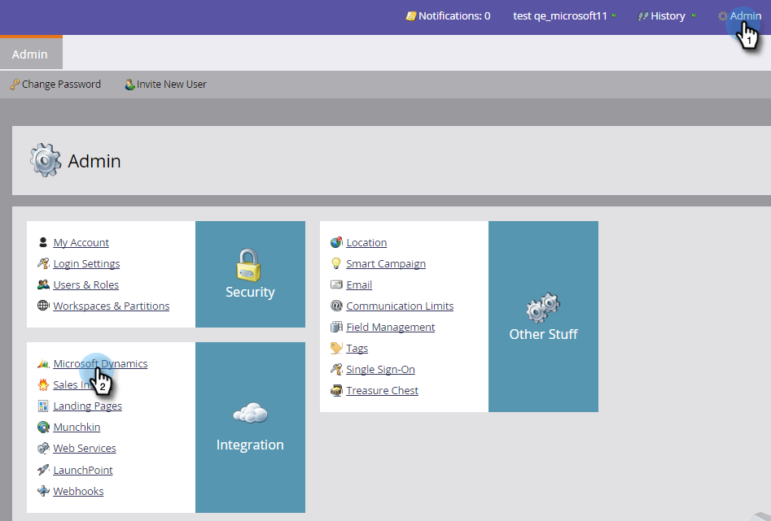
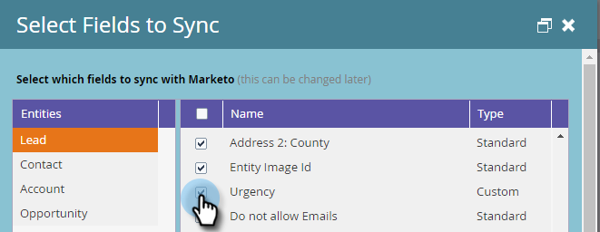
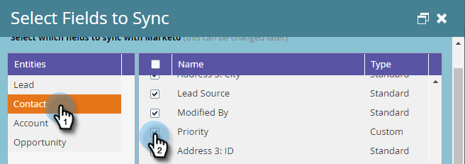

# 将Marketo与Dynamics同步的必填字段 {#required-fields-for-syncing-marketo-with-dynamics}

这些字段 *必须* 与Marketo同步，以便潜在客户和联系人能够进行Sales Insight：

* 优先级
* 紧急
* 相对分数

如果缺少其中任何字段，您将在Marketo中看到一条错误消息，其中包含缺少的字段的名称。 要解决此问题，请签入您的实例以确保这两个字段都同步 **商机** 和 **联系人**. 如果不能，请添加它们。

以下是如何验证和添加同步字段。

1. 转到“管理员”并单击 **Microsoft Dynamics**.

   

1. 单击 **编辑** 在字段同步详细信息上。

   

1. 在Lead下，选中Priority复选框。

   

1. 现在，向下滚动并选中紧急状态复选框……

   

1. ...和“相对分数”复选框。

   

1. 接下来，选中“优先级”、“紧急程度”和“联系人的相对分数”复选框。

   

1. 单击 **保存**.

   

>[!NOTE]
>
>请确保至少等待10分钟，以便运行同步，然后再验证是否已修复此问题。

>[!MORELIKETHIS]
>
>[为潜在客户/联系人记录设置星星和火焰](/help/marketo/product-docs/marketo-sales-insight/msi-for-microsoft-dynamics/setting-up-and-using/setting-up-stars-and-flames-for-lead-contact-records.md)
