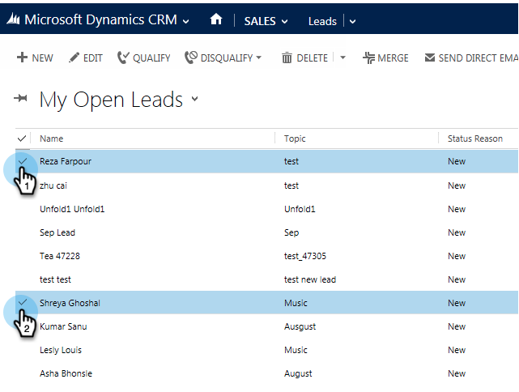

# 从Marketo Dynamics发送Microsoft销售电子邮件 {#send-a-marketo-sales-email-from-microsoft-dynamics}

您的销售团队可以在Microsoft Dynamics中直接发送电子邮件，并对打开数和点击数进行跟踪。 这是方法。

1. 在Dynamics中，转到 **销售** 的上界。

   

1. 选择 **系统视图**.

   

1. 选择一个或多个潜在客户。

   

1. 单击 **...** ，然后单击 **发送Marketo电子邮件**.

   

   >[!TIP]
   >
   >您可以 [作为模板发布电子邮件](/help/marketo/product-docs/marketo-sales-insight/msi-for-salesforce/features/actions-in-the-msi-panel/send-marketo-email/publish-an-email-to-sales-insight.md) 供您的销售团队使用。

1. 添加主题，撰写电子邮件并单击 **发送电子邮件**. （如果需要模板，请选取模板。）

   

   您可以单击 **发送测试电子邮件** 首先，您将收到该电子邮件(Microsoft Dynamics中的主要电子邮件地址)，然后再发送实际的电子邮件。

干得好！ 现在，您已了解如何直接在Marketo Dynamics中发送Microsoft跟踪电子邮件。

>[!MORELIKETHIS]
>
>[从Microsoft Dynamics向Marketo促销活动添加潜在客户/联系人](/help/marketo/product-docs/marketo-sales-insight/msi-for-microsoft-dynamics/setting-up-and-using/add-a-lead-contact-to-a-marketo-campaign-from-microsoft-dynamics.md)
