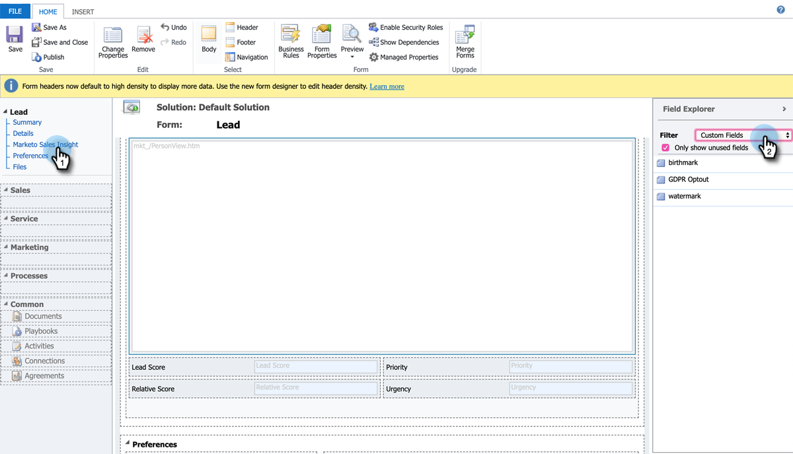

# 为潜在客户/联系人记录设置星星和火焰 {#setting-up-stars-and-flames-for-lead-contact-records}

潜在客户/联系人记录中的星级和火焰取决于以下字段：潜在客户得分、相对得分、紧急程度和优先级。 安装和配置MSI解决方案后，这些字段默认可用。 如果没有星星和火焰，则之前的设置/自定义可能会导致它们被删除。 执行以下步骤以添加它们。

1. 在Microsoft Dynamics中，单击Sales下拉菜单并选择 **设置**. 单击 **自定义**，则 **自定义系统**.

1. 在左侧面板中，单击 **实体**.

1. 查找并单击 **商机**，则 **Forms**，然后选择要编辑的表单。

   

1. 单击 **Marketo Sales Insight** 左侧面板中。 在右侧面板中，单击过滤器下拉菜单并选择 **自定义字段**.

   

1. 拖放以下字段：“潜在客户得分”、“相对得分”、“紧迫性”和“优先级”。 以最适合您的方式排列它们。 您还可以通过双击任何字段来设置其格式。

1. 完成后，单击 **保存并关闭**.
