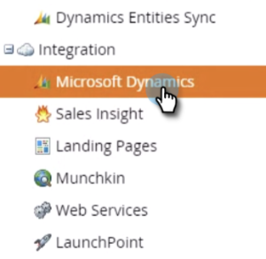
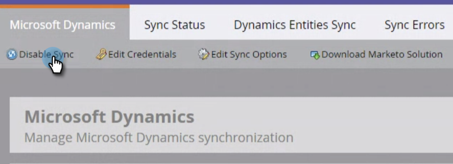

# 禁用全局MS Dynamics同步 {#disable-global-ms-dynamics-sync}

按照以下简单步骤禁用MS Dynamics同步。

1. 在Marketo中，单击 **管理员**.

   

1. 在集成下，单击 **Microsoft Dynamics**.

   

1. 单击 **禁用同步**.

   

   >[!NOTE]
   >
   >如果您的实例中未显示“禁用同步”按钮，请联系 [Marketo支持](https://nation.marketo.com/t5/Support/ct-p/Support).
