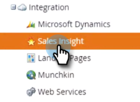

# 从MS Dynamics实例卸载MSI {#uninstall-msi-from-your-ms-dynamics-instance}

要从MS Dynamics实例卸载MSI，您需要同时在Marketo和MS Dynamics中执行步骤。

>[!PREREQUISITES]
>
>[禁用全局MS Dynamics同步](/help/marketo/product-docs/marketo-sales-insight/msi-for-microsoft-dynamics/uninstalling/disable-global-ms-dynamics-sync.md)

1. 在Marketo中，单击 **管理员**.

   

1. 单击 **销售分析**.

   

1. 单击 **编辑字段同步**.

   

1. 选择 **禁用同步** 复选框，然后单击 **保存**.

   >[!NOTE]
   >
   >确保您 [禁用全局MS Dynamics同步](/help/marketo/product-docs/marketo-sales-insight/msi-for-microsoft-dynamics/uninstalling/disable-global-ms-dynamics-sync.md) ，然后再禁用字段同步。

   

## 在MS Dynamics实例中执行以下步骤： {#the-following-steps-take-place-in-your-ms-dynamics-instance}

1. 单击 **高级设置**.

1. 单击 **解决方案**.

1. 选择 **Marketo Sales Insight** ，然后单击删除图标。

1. 当弹出Uninstall Solution模式时，单击 **确定**.

   完全卸载MS Dynamics解决方案通常需要大约20分钟。 但是，如果您有一个大的MS Dynamics实例，则可能需要更长的时间。

   >[!NOTE]
   >
   >卸载MSI后，请记得打开全局MS Dynamics同步。
