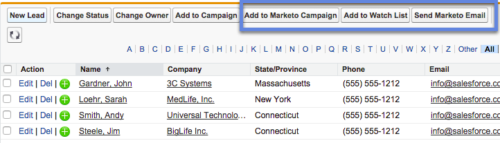
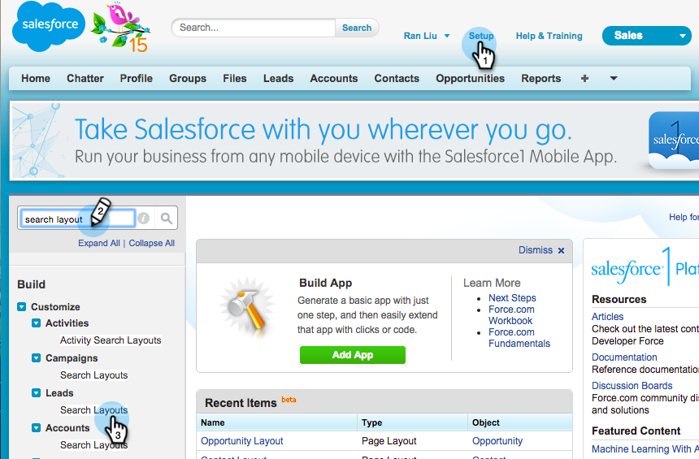

# 将批量操作按钮添加到Salesforce Classic{#add-bulk-action-buttons-to-salesforce-classic}

您可以将Marketo按钮添加到Salesforce布局。 示例如下：

1. 单击 **设置**. 搜索“搜索布局”并单击 **搜索布局** 下 **潜在客户**.

   

1. 单击 **编辑** 在 **潜在客户列表视图** 行。

   

1. 添加 **添加到Marketo Campaign**， **发送Marketo电子邮件**、和 **添加到观察列表** 按钮 **选定的按钮** 和 **保存**.

   

   >[!TIP]
   >
   >按住Shift键同时选择所有三个按钮。

1. 对“联系人”（所有三个按钮）和“帐户”（只有一个按钮：“添加到观察列表”）重复这些步骤。

   >[!NOTE]
   >
   >您无法将Marketo按钮添加到业务机会。
