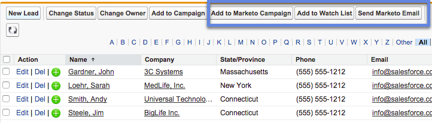

# 将批量操作按钮添加到[!DNL Salesforce] Classic{#add-bulk-action-buttons-to-salesforce-classic}

您可以将Marketo按钮添加到您的[!DNL Salesforce]布局。 示例如下：

1. 单击 **[!UICONTROL Setup]**。 搜索“[!UICONTROL search layout]”并单击&#x200B;**[!UICONTROL Leads]**&#x200B;下的&#x200B;**[!UICONTROL Search Layouts]**。

   

1. 单击&#x200B;**[!UICONTROL Leads List View]**&#x200B;行中的&#x200B;**[!UICONTROL Edit]**。

   

1. 将&#x200B;**[!UICONTROL Add to Marketo Campaign]**、**[!UICONTROL Send Marketo Email]**&#x200B;和&#x200B;**[!UICONTROL Add to Watch List]**&#x200B;按钮添加到&#x200B;**[!UICONTROL Selected Buttons]**&#x200B;和&#x200B;**[!UICONTROL Save]**。

   

   >[!TIP]
   >
   >按住Shift键同时选择所有三个按钮。

1. 对“联系人”（所有三个按钮）和“帐户”（只有一个按钮：“添加到观察列表”）重复这些步骤。

   >[!NOTE]
   >
   >您无法将Marketo按钮添加到业务机会。
