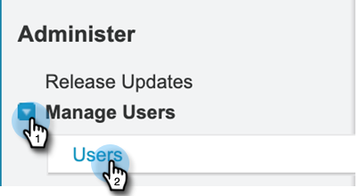

# 添加[!DNL Sales Insight]权限集 {#add-sales-insight-permission-set}

使用以下步骤添加对[!DNL Sales Insight]中[!DNL Salesforce]功能的访问权限。 适用于[!DNL Salesforce] Classic和变亮

>[!PREREQUISITES]
>
>[将您的 [!DNL Sales Insight] [!DNL Salesforce]包](/help/marketo/product-docs/marketo-sales-insight/msi-for-salesforce/upgrading/upgrading-your-msi-package.md){target="_blank"}更新到1.8000版或更高版本，以便使用此功能。

>[!IMPORTANT]
>
>如果您之前授予了所有配置文件的[!DNL Sales Insight]访问权限，并且/或者为所有的用户实施了[!DNL Sales Insight]，则您必须[删除配置文件级别的访问权限](/help/marketo/product-docs/marketo-sales-insight/msi-for-salesforce/configuration/remove-sales-insight-access.md){target="_blank"}才能使用此权限集。

## 概述 {#overview}

“Marketo应用程序”权限是[!DNL Sales Insight] [!DNL Salesforce]包的一部分。 它包括访问以下提及的对象、Apex类和Visualforce页面。 访问所有[!DNL Sales Insight]功能需要这些权限。

**对象设置**

<table>
 <tbody>
 <tr>
   <td>BestBetsCache</td>
   <td>读取、创建、编辑、删除、查看全部、修改全部</td>
  </tr>
  <tr>
   <td>最佳匹配视图详细信息</td>
   <td>读取、创建、编辑、删除、查看全部、修改全部</td>
  </tr>
  <tr>
   <td>最佳视图</td>
   <td>读取、创建、编辑、删除、查看全部、修改全部</td>
  </tr>
  <tr>
   <td>EmailActivityCache</td>
   <td>读取、创建、编辑、删除、查看全部、修改全部</td>
  </tr>
  <tr>
   <td>GetMethodArgus</td>
   <td>读取、创建、编辑、删除、查看全部、修改全部</td>
  </tr>
  <tr>
   <td>GroupedWebActivityCache</td>
   <td>读取、创建、编辑、删除、查看全部、修改全部</td>
  </tr>
  <tr>
   <td>InterestedMentsCache</td>
   <td>读取、创建、编辑、删除、查看全部、修改全部</td>
  </tr>
  <tr>
   <td>Marketo [!DNL Sales Insight]配置</td>
   <td>读取、创建、编辑、删除、查看全部、修改全部</td>
  </tr>
  <tr>
   <td>评分缓存</td>
   <td>读取、创建、编辑、删除、查看全部、修改全部</td>
  </tr>
  <tr>
   <td>值</td>
   <td>读取、创建、编辑、删除、查看全部、修改全部</td>
  </tr>
  <tr>
   <td>WebActivityCache</td>
   <td>读取、创建、编辑、删除、查看全部、修改全部</td>
  </tr>
 </tbody>
</table>

* Apex类访问：以“mkto_si”开头的159个Apex类
* Visualforce页面访问：64个以“mkto_si”开头的Visualforce页面
* 自定义设置定义：mkto_si.Marketo设置和mkto_si.User首选项

## 将Marketo应用程序权限集添加到用户 {#adding-marketo-app-permission-set-to-users}

1. 登录到您的[!DNL Salesforce]帐户。

1. 单击 **[!UICONTROL Setup]**。

   

1. 在“管理员”下，单击展开&#x200B;**[!UICONTROL Manage Users]**，然后单击&#x200B;**[!UICONTROL Users]**。

   

1. 在“所有用户”下，选择要提供访问权限的用户，然后单击&#x200B;**[!UICONTROL Permission Set Assignments]**。

   

1. 单击 **[!UICONTROL Edit Assignments]**。

   

1. 从可用权限集中选择&#x200B;**[!UICONTROL Marketo App Access]**，然后选择&#x200B;**[!UICONTROL Add]**。 单击 **[!UICONTROL Save]**。

   

1. 现在，当您向下滚动“用户详细信息”页面时，您会在权限集分配下看到“Marketo应用程序访问权限”。

   

>[!NOTE]
>
>无权访问[!DNL Sales Insight]的用户将看到此消息：“您没有足够的权限访问此选项卡。”

操作完成！您已成功添加[!DNL Sales Insight]访问权限。 对要为其添加访问权限的任何其他配置文件重复相同的步骤。
