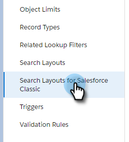

# Salesforce Lightning中的批量操作 {#bulk-actions-in-salesforce-lightning}

以下说明如何在Salesforce Lightning中设置批量操作。

1. 在Salesforce中，单击“设置”图标并选择 **设置**.

   

1. 单击 **对象管理器** 选项卡。

   

1. 查找并选择 **商机** 标签。

   

1. 单击 **搜索Salesforce Classic布局**.

   

   查找“列表视图”布局。 单击右侧的下拉菜单并选择 **编辑**.

   

1. 在自定义按钮下，查找并选择 **添加到Marketo Campaign（闪电）** 和 **发送Marketo电子邮件（闪电）**. 单击 **添加** 按钮。

   

1. 单击 **保存**.

   

   您现在可以在“潜在客户列表”视图中查看批量操作按钮。

   >[!NOTE]
   >
   >重复相同步骤以在“联系人”列表视图中添加批量操作。
