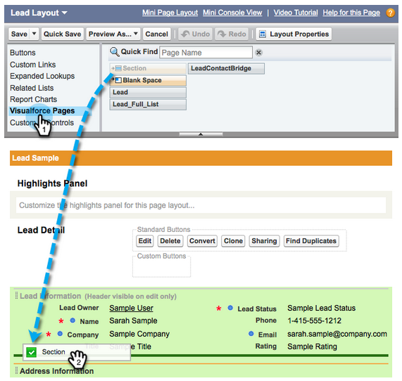

# 在Salesforce企业/无限制中配置Marketo Sales Insight {#configure-marketo-sales-insight-in-salesforce-enterprise-unlimited}

以下是在Salesforce企业版/无限制版中配置Marketo Sales Insight时需要执行的步骤。 我们开始吧。

>[!PREREQUISITES]
>
>[在SalesforceAppExchange中安装Marketo Sales Insight包](/help/marketo/product-docs/marketo-sales-insight/msi-for-salesforce/installation/install-marketo-sales-insight-package-in-salesforce-appexchange.md)

>[!NOTE]
>
>**需要管理员权限**

## 在Marketo中配置Sales Insight {#configure-sales-insight-in-marketo}

1. 在Marketo中获取您的MSI凭据。 转到“管理员”区域，然后选择 **销售分析**.

   

1. 单击 **编辑API配置**.

   

1. 输入您选择的API密钥，然后单击 **保存**. 请勿在API密钥中使用与号(&amp;)。

   

   >[!NOTE]
   >
   >您的API密钥类似于组织的密码，应该是安全的。

1. 单击 **查看** 在Rest API配置面板中填充凭据。

   

1. 您将看到确认弹出窗口。 单击 **确定**.

   

   >[!TIP]
   >
   >保持此窗口打开。 您稍后在Salesforce中将需要此信息。

## 在Salesforce中配置销售分析 {#configure-sales-insight-in-salesforce}

1. 在Salesforce中，单击 **设置**.

   

1. 搜索“远程站点”并选择 **远程站点设置**.

   

1. 单击 **新建远程站点**.

   

1. 输入远程站点名称（可以是类似于“MarketoSoapAPI”的内容）。 从Marketo的Soap API配置面板中输入远程站点URL，即您的Marketo主机URL。 单击 **保存**. 您现在已为Soap API创建远程站点设置。

   

1. 单击 **新建远程站点** 再次。

   

1. 输入远程站点名称（可以是类似于“MarketoAPI”的内容）。 输入远程站点URL，即Marketo中Rest API配置面板中的API URL。 单击 **保存**. 您现在已为Rest API创建了远程站点设置。

   >[!NOTE]
   >
   >_您_ 选择 **远程站点名称** （此处使用MarketoAPI）。 的 **远程站点URL** 可在“在Marketo中配置销售分析”部分步骤3中的“编辑API配置”对话框的“Marketo主机”字段中找到。

## 自定义页面布局 {#customize-page-layouts}

1. 单击 **设置**.

   

1. 搜索“页面布局”并选择 **页面布局** 在 **潜在客户**.

   

1. 单击 **可视化强制页面** 左边。 拖动 **区域** 到“自定义链接”部分下的布局。

   

1. 输入“Marketo Sales Insight”作为 **节名称**. 选择 **1列** 单击 **确定**.

   

1. 拖放 **商机** 到新部分。

   

   >[!TIP]
   >
   >此框的名称将根据对象类型进行更改。 例如，如果您修改“联系人”的页面布局，则会显示“联系人”。

1. 双击 **商机** 阻止您添加。

   

1. 将高度编辑为 **450** 像素和单击 **确定**.

   

   >[!TIP]
   >
   >我们建议Accounts和Opportunitys对象的高度为410像素。

1. 单击 **字段** 左边。 然后，搜索并拖动 **紧急** 标签 **Marketo Sales Insight** 布局。

   

1. 对这些字段重复上述步骤。

   <table> 
    <tbody> 
     <tr> 
      <td>最后一个有趣的时刻</td> 
     </tr> 
     <tr> 
      <td>最后有趣的时刻日期</td> 
     </tr> 
     <tr> 
      <td>最后一个有趣的时刻</td> 
     </tr> 
     <tr> 
      <td>最后有趣的时刻来源</td> 
     </tr> 
     <tr> 
      <td>最后有趣的时刻类型</td> 
     </tr> 
     <tr> 
      <td>上次Marketo活动（按销售）</td> 
     </tr> 
     <tr> 
      <td>上次按销售额划分的Marketo参与度</td> 
     </tr> 
     <tr> 
      <td>MSI联系人Id</td> 
     </tr> 
     <tr> 
      <td>相对分数</td> 
     </tr> 
     <tr> 
      <td>相对分数值</td> 
     </tr> 
     <tr> 
      <td>紧急</td> 
     </tr> 
     <tr> 
      <td>紧急价值</td> 
     </tr> 
     <tr> 
      <td>在Marketo中查看</td> 
     </tr> 
    </tbody> 
   </table>

1. 单击 **保存** 完成。

   

1. 重复步骤5-7，为 **联系人**, **帐户** 和 **机会**.

1. 重复步骤8-10，以从下面的列表中为 **联系人**. 确保保存任何更改。

<table> 
    <tbody> 
     <tr> 
      <td>最后一个有趣的时刻</td> 
     </tr> 
     <tr> 
      <td>最后有趣的时刻日期</td> 
     </tr> 
     <tr> 
      <td>最后一个有趣的时刻</td> 
     </tr> 
     <tr> 
      <td>最后有趣的时刻来源</td> 
     </tr> 
     <tr> 
      <td>最后有趣的时刻类型</td> 
     </tr> 
     <tr> 
      <td>上次Marketo活动（按销售）</td> 
     </tr> 
     <tr> 
      <td>上次按销售额划分的Marketo参与度</td> 
     </tr> 
     <tr> 
      <td>MKTO潜在客户得分</td> 
     </tr> 
     <tr> 
      <td>相对分数</td> 
     </tr> 
     <tr> 
      <td>相对分数值</td> 
     </tr> 
     <tr> 
      <td>销售分析 — 打开联系人完整列表页面</td> 
     </tr> 
     <tr> 
      <td>紧急</td> 
     </tr> 
     <tr> 
      <td>紧急价值</td> 
     </tr> 
    </tbody> 
   </table>

## 映射自定义人员字段 {#map-custom-person-fields}

Marketo人员字段需要映射到Salesforce联系字段，以确保转换正常工作。 这是方法。

1. 单击 **设置**.

   

1. 在搜索栏中搜索“字段”并单击 **字段** 在 **潜在客户**.

   

1. 单击 **映射潜在客户字段**.

   

1. 单击右侧的下拉菜单 **参与度**.

   

1. 选择 **Contact.Engagement** 列表中。

   

1. 重复并映射这些字段。

   <table> 
    <tbody> 
     <tr> 
      <th colspan="1" rowspan="1">Marketo人员自定义字段</th> 
      <th colspan="1" rowspan="1">Salesforce联系人自定义字段</th> 
     </tr> 
     <tr> 
      <td colspan="1" rowspan="1">
参与度
</td> 
      <td colspan="1" rowspan="1">
Contact.Engagement
</td> 
     </tr> 
     <tr> 
      <td colspan="1" rowspan="1">
相对分数值
</td> 
      <td colspan="1" rowspan="1">
Contact.Relative Score值
</td> 
     </tr> 
     <tr> 
      <td colspan="1" rowspan="1">
紧急价值
</td> 
      <td colspan="1" rowspan="1">
Contact.Urgency值
</td> 
     </tr> 
     <tr> 
      <td colspan="1" rowspan="1">
最后有趣的时刻日期
</td> 
      <td colspan="1" rowspan="1">
联系人。最后一个有趣的时刻日期
</td> 
     </tr> 
     <tr> 
      <td colspan="1" rowspan="1">
最后一个有趣的时刻
</td> 
      <td colspan="1" rowspan="1">
Contact.Last Interest Moment Desc
</td> 
     </tr> 
     <tr> 
      <td colspan="1" rowspan="1">
最后有趣的时刻来源
</td> 
      <td colspan="1" rowspan="1">
Contact.Last Interest Moment Source
</td> 
     </tr> 
     <tr> 
      <td colspan="1" rowspan="1">
最后有趣的时刻类型
</td> 
      <td colspan="1" rowspan="1">
Contact.Last Interest Moment Type
</td> 
     </tr> 
    </tbody> 
   </table>

1. 单击 **保存** 等你完事了。

## Marketo Sales Insight配置 {#marketo-sales-insight-config}

1. 单击 **+** 然后选择 **Marketo Sales Insight配置**.

   

1. 检查 **启用Marketo API**. 然后，在 [Marketo管理员中的API配置信息](#set-up-marketo-sales-insight). 单击 **保存更改** 等你完事了。

   

   >[!NOTE]
   >
   >如果诊断测试失败，您可能需要 [向页面布局添加更多字段](https://nation.marketo.com/docs/DOC-1115).

就这样！ 您应该能够看到“潜在客户”、“联系人”、“帐户”和“业务机会”的“Marketo销售分析”字段。

>[!NOTE]
>
>对于帐户，Sales Insight将包含所有电子邮件，但只包含最近的有趣时刻、Web活动和得分变化。

## 访问Marketo Sales Insight {#access-marketo-sales-insight}

1. 在Salesforce中，单击 **+** 单击 **Marketo Sales Insight配置**.

1. 选择 **启用Marketo API** 复选框。

1. 从Marketo的“销售分析管理”页面的Soap API面板复制凭据，并将凭据粘贴到“Salesforce销售分析配置”页面的Soap API部分。

1. 从Marketo的“销售分析管理”页面的Rest API面板中复制凭据，并将其粘贴到“Salesforce销售分析配置”页面的Rest API部分。

   

>[!MORELIKETHIS]
>
>* [优先级、紧急性、相对得分和最佳押注](/help/marketo/product-docs/marketo-sales-insight/msi-for-salesforce/features/stars-and-flames/priority-urgency-relative-score-and-best-bets.md)
>* [将Marketo选项卡添加到Salesforce](/help/marketo/product-docs/marketo-sales-insight/msi-for-salesforce/configuration/add-marketo-tab-to-salesforce.md)
>* [为团队设置销售分析](/help/marketo/product-docs/marketo-sales-insight/msi-for-salesforce/configuration/setting-up-sales-insight-for-your-team.md)

